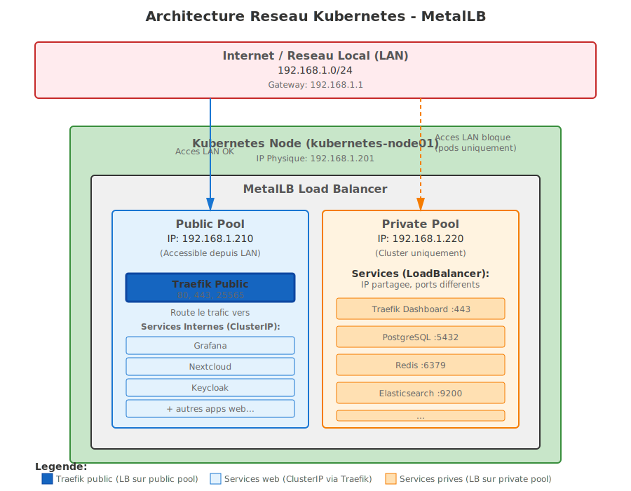

# Kubernetes Homelab Setup with Ansible

Automated deployment of a production-ready Kubernetes cluster using Ansible and MicroK8s with comprehensive application stack and security hardening.

## Overview

This project automates the complete setup of a Kubernetes homelab environment, from initial server provisioning with security hardening to deploying a full stack of applications including monitoring, databases, web services, and VPN access.

## Features

- **Automated Server Provisioning**: SSH hardening, user management, network configuration
- **MicroK8s High Availability**: Kubernetes cluster deployment with built-in HA support
- **Security Hardening**: fail2ban, custom SSH port, automatic security updates, network policies
- **Application Stack**: 20+ pre-configured applications ready to deploy
- **Network Management**: MetalLB load balancing, Traefik ingress, CoreDNS local resolution
- **Monitoring & Logs**: Prometheus for metrics, Loki + Promtail for logs, Grafana dashboards — Loki is set as Grafana's default datasource so **Explore** opens straight to log search
- **Declarative uptime monitoring**: Uptime Kuma + AutoKuma — drop a `KumaEntity` Custom Resource next to a service and the monitor appears in Kuma automatically
- **Declarative dashboard**: Heimdall reconciled from Ansible — edit one list in `heimdall.yml`; entries appear, update, or disappear on the next playbook run. Items added manually through the Heimdall UI are left untouched
- **Backup & DR**: Velero + Kopia → Scaleway Object Storage with nightly/weekly data schedules + a weekly cluster-state schedule (CRDs, PVs, cluster-scoped resources)
- **Tailscale**: Zero-config mesh VPN with subnet router for LAN and cluster CIDR access

## Public vs Private exposure model

This is the security contract of the cluster. Each row is enforced by a specific layer; if you change a layer, re-read this section.

| Class | LB IP | Reachable from | Layers in front of the backend |
|---|---|---|---|
| **Public services** (nginx, n8n-webhook-proxy, minecraft) | `192.168.1.210` (`traefik-public`) | Internet via Cloudflare → router NAT 80/443/25565 → 192.168.1.210. The same IP is reachable from the LAN, but `cloudflare-ips` rejects non-Cloudflare source IPs. | Cloudflare (WAF/DDoS) → router NAT → `traefik-public` (`externalTrafficPolicy: Local`, real client IP preserved) → `public-security` middleware (`cloudflare-ips` ipAllowList **+** `crowdsec-bouncer` plugin) → Let's Encrypt TLS → ClusterIP backend → per-namespace NetworkPolicy (`allow-from-traefik`). |
| **Private services** (heimdall, grafana, prometheus, alertmanager, kibana, kuma, portainer, pgadmin, n8n, ghostfolio, jellyfin, qbittorrent, traefik dashboard) | `192.168.1.220` (`traefik-private`) | LAN (`192.168.1.0/24`) and Tailscale (subnet router advertises `192.168.1.0/24`). **No port-forward** on the home router → unreachable from the Internet. | LAN/tailnet ACL → `traefik-private` → `whitelist-local` middleware (`127.0.0.1/8`, `192.168.0.0/16`, `10.0.0.0/8`, `100.64.0.0/10`) → ClusterIP backend → per-namespace NetworkPolicy (`allow-from-traefik`). |
| **Databases / caches / search** (PostgreSQL, Redis, Elasticsearch) | none — ClusterIP only | Inside the cluster, only from namespaces explicitly whitelisted (e.g. PostgreSQL accepts `ghostfolio`, `nextcloud`, `pgadmin`; Redis accepts `ghostfolio`, `redisinsight`). | NetworkPolicy `default-deny` + an explicit per-app `allow-ingress` rule. The `tailscale` namespace is **never** whitelisted, so a tailnet client cannot reach DB ports directly even though it can route to the service CIDR. |
| **CoreDNS local** | `192.168.1.220:53` (UDP/TCP), shared with Traefik private | LAN + Tailscale | NetworkPolicy restricts ingress to DNS-only ports; egress for upstream resolvers is allowed but the LAN CIDR is excepted (`block LAN`). |
| **Cluster API** | tailnet HTTPS proxy (Tailscale operator) | Tailscale only | Tailnet ACL + Kubernetes RBAC. |

### Why each layer is necessary

- **Cloudflare IP allowlist** in `public-security`: prevents anyone from bypassing Cloudflare by hitting the public IP directly (e.g. someone who learns the home WAN IP). Real client IPs are preserved on `traefik-public` because we set `externalTrafficPolicy: Local`.
- **CrowdSec bouncer**: blocks IPs known for scanning/abuse before the backend is touched. Ban decisions are sourced from Traefik access logs and the public LAPI.
- **Whitelist-local** on private routes: defence in depth. Today the IP `192.168.1.220` is only reachable from the LAN/tailnet by network topology, but if a misconfiguration ever exposed it (extra port-forward, bridged IoT VLAN, …) the middleware would still reject anything outside the local CIDRs.
- **Per-namespace NetworkPolicies**: ensure that even traffic that arrives via the cluster CIDR (e.g. a tailnet kubectl user, or a compromised public service trying to talk to the DB) cannot reach a backend it has no business reaching. The `tailscale` namespace is deliberately excluded from every "allow from X" list so subnet routing cannot be abused as a shortcut.
- **`block-local-lan-egress-except-gw-nfs`** (in `roles/kube-services-setup/tasks/block-local-access.yml`): every workload namespace blocks egress to the LAN CIDR except the gateway. Stops a compromised pod from pivoting into the LAN.

### Operational hygiene / known trade-offs

These are deliberate compromises documented here so they are not mistaken for bugs:

- **`traefik-private` keeps `externalTrafficPolicy: Cluster`** (only `traefik-public` is patched to `Local`). On a multi-node cluster this means MetalLB may SNAT the source IP to the receiving node before the packet reaches the Traefik pod, so private access logs do not always show the real client IP. Functionally the `whitelist-local` middleware still passes (node IPs and pod IPs are inside `192.168.0.0/16` / `10.0.0.0/8`), but the middleware is mostly defence-in-depth — the real gate for the private flow is "can you route to `192.168.1.220` at all?". On a single-node setup the SNAT only happens for routed (non-local) clients, so the impact is minimal.
- **`whitelist-local` is broad**: it accepts the entire LAN plus Tailscale CGNAT (`100.64.0.0/10`). If the home network has untrusted devices (IoT, guest Wi-Fi sharing the same subnet) any of them can attempt to load a private service and will only be stopped by the application's own auth. Tighten by editing the middleware `sourceRange` in `roles/kube-services-setup/tasks/traefik.yml` if you need a stricter perimeter.
- **Private routes accept HTTP (`web-private`) as well as HTTPS (`websecure-private`)**, with no automatic redirect. Traffic between the subnet router and `192.168.1.220` is on the LAN — encrypted only on the Tailscale leg, not on the LAN hop. Application credentials travel in clear if the user picks `http://`. To force HTTPS everywhere, add the `redirect-to-https` middleware to the private IngressRoutes (the same way it is wired on `nginx-http-redirect`).
- **Tailscale subnet router advertises pod and service CIDRs** (`10.1.0.0/16`, `10.152.183.0/24`). This is intentional — kubectl debug, raw service troubleshooting — but it means the *tailnet ACL* is part of the security boundary. Keep it tag-scoped, not "all users".

## Network Policies

This repository implements a comprehensive zero-trust network security model. Every namespace defaults to deny-all and re-opens only the flows it actually needs, layered on top of `block-local-access.yml` (a per-namespace egress policy that blocks the LAN CIDR by default).

### Security model

- **Default-deny everywhere we can.** Every application namespace starts with a default-deny policy for both Ingress and Egress. The exceptions (`tailscale`, `dns-system`, `cert-manager`, `metallb-system`, `kube-system`) are documented inline in each task file with the reason — typically host-network pods (NetworkPolicies do not apply), or operator-managed pods whose labels we don't control.
- **Zero trust.** Nothing is allowed except by an explicit `allow-*` policy. Re-opens are scoped to the smallest selector that still works (a single pod label set, a specific port, a specific peer namespace).
- **Defense in depth.** NetworkPolicies, Traefik middleware (`whitelist-local`, `cloudflare-ips`, `crowdsec-bouncer`), CrowdSec firewall bouncer, and the global LAN-egress block all stack — a misconfiguration in any one layer doesn't open the whole stack.

### How the YAML stays maintainable

NetworkPolicies look almost identical across services (default-deny, DNS egress, Traefik ingress, …). Without a helper layer, the same ~30 lines of YAML would be repeated 20+ times and would drift out of sync the moment a pattern needs to change.

To keep things tight, the boilerplate is encapsulated in a small library of include-able task files under [`roles/kube-services-setup/tasks/_netpol/`](roles/kube-services-setup/tasks/_netpol/). Each helper creates exactly one `NetworkPolicy` and is parameterized by the bits that actually vary (namespace, pod selector, port).

A typical service file's NetworkPolicy section now reads like a manifest of intent:

```yaml
- include_tasks: _netpol/default-deny.yml
  vars: { ns: pgadmin }

- include_tasks: _netpol/dns-egress.yml
  vars: { ns: pgadmin }

- include_tasks: _netpol/traefik-ingress.yml
  vars:
    ns: pgadmin
    pod_selector: { app: pgadmin }
    port: 80

- include_tasks: _netpol/egress-to-namespace.yml
  vars:
    ns: pgadmin
    name: postgresql
    pod_selector: { app: pgadmin }
    target_namespace: postgresql
    port: 5432
```

The full helper catalogue with required/optional variables lives in [`_netpol/README.md`](roles/kube-services-setup/tasks/_netpol/README.md). The high-level summary:

| Helper | Adds | Typical caller |
|---|---|---|
| `default-deny.yml` | `<ns>-default-deny` (Ingress + Egress) | Almost every namespace |
| `dns-egress.yml` | DNS to CoreDNS pods (UDP/TCP 53) | Every namespace under default-deny |
| `intra-namespace.yml` | Pod-to-pod traffic inside the namespace | Multi-pod stacks (postgresql, redis, ECK, prometheus, …) |
| `kubeapi-egress.yml` | Egress to the kube-apiserver (svc + node ports) | Operators and controllers |
| `node-ingress.yml` | Ingress from the node CIDR (kubelet probes) | argocd, tailscale |
| `web-egress.yml` | Egress to the Internet on the requested ports, LAN blocked | App namespaces that hit external HTTP(S) |
| `traefik-ingress.yml` | Ingress from the `traefik` namespace on a port | Every Traefik-fronted backend |
| `prometheus-scrape.yml` | Ingress from the `monitoring` namespace on the metrics ports | Every ServiceMonitor target |
| `kuma-probe.yml` | Ingress from Uptime Kuma (TCP probe) | DBs probed by Kuma directly |
| `egress-to-namespace.yml` | Egress to a specific peer namespace on a port/list of ports | DB clients, controller-to-target traffic |

Anything that's truly service-specific (e.g. ECK pod-to-pod, Traefik's egress to every backend namespace, the Filebeat egress block, the `traefik-allow-all-ingress` 0.0.0.0/0 rule) stays inline in the service file with a clear name.

### Adding a new service

1. Create the service's task file under `roles/kube-services-setup/tasks/<service>.yml` and register it in `main.yml`.
2. Drop in the helpers it needs — most web apps want `default-deny`, `dns-egress`, `traefik-ingress`, and (if applicable) `egress-to-namespace` for a database, plus `web-egress` if it calls external APIs.
3. If a metrics endpoint is exposed, add a `prometheus-scrape.yml` call — Prometheus's egress is namespace-wide, but the target's ingress is what actually gates the scrape.
4. If a database wants to accept the new namespace, add it to the `*_client_namespaces` list in `postgresql.yml` / `redis.yml`.
5. If the service must be reachable through Traefik, add the namespace to `traefik_backend_namespaces` in `traefik.yml`.

### Per-namespace flow summary

| Namespace | Default-deny | DNS | Intra-ns | Ingress | Egress |
|---|---|---|---|---|---|
| `argocd` | ✅ | ✅ | ✅ | Traefik (8080), kubelet probes | kube-apiserver, intra-NS, repo-server → Git, notifications → Internet |
| `autokuma` | ✅ | ✅ | — | — | kube-apiserver, Kuma (3001) |
| `cert-manager` | egress-only (no Ingress restriction) | ✅ | — | — | kube-apiserver, ACME/Cloudflare (🔒 LAN blocked) |
| `coredns-local` (`dns-system`) | — | self | — | DNS + health probes from anywhere | Upstream DNS (🔒 LAN blocked) |
| `crowdsec` | ✅ | ✅ | ✅ | Traefik → LAPI, agent → LAPI | kube-apiserver, Internet (🔒 LAN blocked) |
| `falco` | ✅ | ✅ | ✅ | Prometheus scrape (8765, 2801) | kube-apiserver, SMTP (🔒 LAN), Internet (🔒 LAN) |
| `ghostfolio` | ✅ | ✅ | — | Traefik (3333) | postgresql (5432), redis (6379), Internet :443 (🔒 LAN) |
| `heimdall` | ✅ | ✅ | — | Traefik (80) | DNS only |
| `kuma` | ✅ | ✅ | — | Traefik (3001), AutoKuma (3001), Prometheus (3001) | Internet (🔒 LAN), DBs/ES/Velero, private + public LB IPs (the only LAN exception) |
| `logging` (ECK) | ✅ | ✅ | ✅ | Traefik → Kibana (5601), inter-pod ES traffic | kube-apiserver, Filebeat → ES/Kibana/Internet (443) |
| `media` (jellyfin + qbittorrent) | ✅ | ✅ | — | Traefik → jellyfin (8096), Traefik → qbittorrent (8080) | jellyfin → Internet :80/:443 (🔒 LAN), qbittorrent → Internet **all ports** (🔒 LAN — trackers + peers) |
| `metallb-system` | egress-only (speaker is host-network → bypassed) | ✅ | — | — | kube-apiserver |
| `minecraft` | ✅ | ✅ | — | Traefik (25565), Prometheus (9225) | Internet (🔒 LAN) |
| `monitoring` | ✅ | ✅ | ✅ | Traefik → Grafana/Prometheus/Alertmanager | kube-apiserver, Prometheus → all in-cluster namespaces |
| `n8n` | ✅ | ✅ | — | Traefik (5678), Prometheus (5678), webhook-proxy (5678) | Internet (🔒 LAN) |
| `n8n-webhook-proxy` | ✅ | ✅ | — | Traefik (3000) | n8n (5678) |
| `nextcloud` | ✅ | ✅ | — | Traefik (80), exporter (80) | postgresql (5432), Internet (🔒 LAN) |
| `nginx` | ✅ | ✅ | — | Traefik (80), exporter → nginx (8080) | DNS only |
| `pgadmin` | ✅ | ✅ | — | Traefik (80) | postgresql (5432) |
| `portainer` | ✅ | ✅ | — | Traefik (9000) | kube-apiserver |
| `postgresql` | ✅ | ✅ | ✅ | `postgresql_client_namespaces` only (5432), Prometheus (9187), Kuma probe (5432) | intra-NS only |
| `redis` | ✅ | ✅ | ✅ | `redis_client_namespaces` only (6379), Prometheus (9121), Kuma probe (6379) | intra-NS only |
| `redisinsight` | ✅ | ✅ | — | Traefik (5540) | redis (6379) |
| `tailscale` | ✅ | ✅ | ✅ | kubelet probes | kube-apiserver, tailnet (control plane / DERP / WireGuard, 🔒 LAN), advertised subnet routes |
| `traefik` | ✅ | ✅ | — | Internet (Cloudflare/CrowdSec gate it at L7) | kube-apiserver, CrowdSec LAPI, every backend namespace, Internet (🔒 LAN) |
| `velero` | ✅ | ✅ | ✅ | Prometheus (8085) | kube-apiserver, S3 :443 (🔒 LAN) |
| `wordpress` | ✅ | ✅ | — | Traefik (8080) | mysql (3306, intra-NS), Internet (🔒 LAN) |

🔒 LAN means egress to the LAN CIDR is blocked while the rest of the Internet remains reachable. The block also applies globally via `block-local-access.yml` (see next section).

### Notes on a few special cases

- **Tailscale, Falco, Filebeat, MetalLB speaker, CrowdSec firewall bouncer.** These run with `hostNetwork: true` for their kernel/wire-level needs. NetworkPolicies do **not** apply to host-network pods, so the policies in those namespaces are scoped to the cluster-network pods only (operator pod, falcosidekick, metallb controller, lapi/agent). The Tailscale tailnet ACL is the actual access boundary for tailnet → cluster traffic.
- **Prometheus egress.** The monitoring namespace allows Prometheus egress to *every* in-cluster namespace, with no port pinning. The previous version pinned a fixed list of ports (9090, 9100, 9187, 8080-8084, …) which silently broke scraping for any new exporter on a port outside the list (Falco 8765, Velero 8085, Kuma 3001, redis-exporter 9121, …). Each scrape target's own ingress policy is the real gate.
- **Database namespaces (`postgresql`, `redis`).** Allowed client namespaces are listed once in a single `*_client_namespaces` Ansible variable inside the namespace's task file. Adding a new client = adding one line.
- **Traefik backends.** Same pattern — `traefik_backend_namespaces` in `traefik.yml` is the single source of truth.

### Global LAN egress block (`block-local-access.yml`)

`roles/kube-services-setup/tasks/block-local-access.yml` runs **after** every service has been deployed and stamps a uniform egress policy onto every namespace except `kube-system`, `kube-public`, and `kube-node-lease`:

- Policy name: `block-local-lan-egress-except-gw-nfs` (per namespace).
- Selector: `{}` — all pods.
- Allows egress to `0.0.0.0/0` **except** the LAN CIDR (`network.private_cidr`), plus an explicit allow to the host gateway `{{ network.host_gateway }}/32` (which is what containerd / NFS volume mounts hit through the host).

`kube-system` is intentionally excluded so the NFS CSI driver can reach the NAS; everything else is forced to either go through the public Internet or stay inside the cluster. Per-namespace policies (the `web-egress` ones) re-open Internet egress on the specific ports each app needs while staying compatible with the LAN block — both policies stack and the more permissive of the two wins on a given destination.

The only deliberate LAN exception is `kuma-allow-traefik-lb-egress` in `kuma.yml`, which lets Uptime Kuma probe its own services through the private + public Traefik LB IPs (`network.private_address`, `network.public_address`) on 80, 443 and 25565. That's the only legal way for an in-cluster pod to dial `192.168.1.220` directly.

### Debugging NetworkPolicies

```bash
# Hit a LAN IP from a throw-away pod to confirm the block is in place.
kubectl run ping-test --rm -it --image=busybox -- ping -c 4 192.168.1.17

# Same idea but from the namespace whose egress you want to audit.
kubectl run -n <namespace> shell --rm -it --image=alpine -- sh -c 'apk add --no-cache curl && curl -m 5 https://1.1.1.1'

# List every NetworkPolicy in a namespace (helpful when adding a new helper call).
kubectl get networkpolicies -n <namespace>

# Inspect a specific policy's rendered spec.
kubectl get networkpolicy -n <namespace> <name> -o yaml
```

If a freshly added service can't reach a dependency, the failure mode is almost always one of: missing `dns-egress`, missing `kubeapi-egress` for a controller, missing `egress-to-namespace` for a peer, or the destination namespace's ingress not whitelisting the source. The NetworkPolicy section of the relevant task file is the single place to look.

## Declarative uptime monitoring (Kuma + AutoKuma)

Uptime Kuma stores monitor definitions in a SQLite database that is normally edited through the UI. To keep the cluster fully reproducible from the Ansible playbook, [AutoKuma](https://github.com/BigBoot/AutoKuma) runs as a controller that watches `KumaEntity` Custom Resources across all namespaces and pushes them to Kuma's Socket.IO API. Add a CR, the monitor appears; delete the CR, the monitor disappears; edit the CR, Kuma reflects the change. No clicks in the UI.

The CRD is namespace-scoped, so each service owns its monitor next to its own manifests (`roles/kube-services-setup/tasks/<service>.yml`).

```yaml
- name: Register Kuma monitor for <service>
  kubernetes.core.k8s:
    state: present
    definition:
      apiVersion: autokuma.bigboot.dev/v1
      kind: KumaEntity
      metadata:
        name: <service>-monitor
        namespace: <service-namespace>
      spec:
        config:
          type: http                              # or `port` for TCP probes
          name: <service>
          url: "http://<host>.{{ network.private_domain }}"
          interval: 60
          maxretries: 2
```

The `spec.config` block accepts every field that the Kuma UI exposes (`type`, `url`, `hostname`, `port`, `interval`, `maxretries`, `accepted_statuscodes`, `notification_name_list`, `tag_names`, …). See the [AutoKuma docs](https://github.com/BigBoot/AutoKuma#monitor-types) for the full list.

Implementation notes:
- The KumaEntity CRD is installed by `roles/kube-services-setup/tasks/autokuma.yml`, which runs **before** any application task file so each service can register its own monitor on the same playbook run.
- Kuma probes services through their real ingress path (DNS → Traefik → backend). The `kuma-allow-traefik-lb-egress` NetworkPolicy in `kuma.yml` is the only exception to the LAN-egress block, scoped to the two Traefik LoadBalancer IPs on ports 80, 443 and 25565 (Minecraft).
- AutoKuma reuses the existing `kuma.username` / `kuma.password` from `secrets.yml` — no new secret to provision.
- All services shipped by this repo are tagged out of the box (Kuma itself, Heimdall, Grafana, Prometheus, Alertmanager, Loki, Portainer, pgAdmin, PostgreSQL, Redis, Ghostfolio, n8n, n8n-webhook-proxy, Nextcloud, Nginx, Wordpress, Minecraft, Jellyfin, qBittorrent).

## Declarative Heimdall dashboard

Heimdall stores its dashboard items in a SQLite database (`/config/www/app.sqlite`) and ships no REST API or CLI for adding apps — every tile would normally have to be added by hand. To keep the cluster fully reproducible from the playbook, `roles/kube-services-setup/tasks/heimdall.yml` declares the desired tiles in a single `heimdall_apps` list at the top of the file and reconciles Heimdall against it at the bottom: missing tiles are inserted, changed fields are updated, and removed entries are soft-deleted on the next playbook run.

The reconciler runs `php artisan tinker --execute` inside the Heimdall pod and uses Eloquent against `App\Item`. `laravel/tinker` is a production dependency of Heimdall (verified in `composer.json`), so this needs no extra packages, no extra egress, and no schema-coupling — `App\Item`'s `$fillable` is the contract.

```yaml
# roles/kube-services-setup/tasks/heimdall.yml — registry at the top
- name: Define Heimdall apps registry
  ansible.builtin.set_fact:
    heimdall_apps:
      - { title: Portainer,  url: "http://portainer.{{ network.private_domain }}", pinned: true }
      - { title: Grafana,    url: "http://grafana.{{ network.private_domain }}",   pinned: true }
      - { title: Jellyfin,   url: "http://jellyfin.{{ network.private_domain }}",  pinned: true }
      # …add or remove entries here; this is the only edit-point.
```

| Field | Required | Default | Notes |
|---|---|---|---|
| `title` | yes | — | Display name **and** idempotency key (rename = old tile pruned, new tile created) |
| `url` | yes | — | Click target |
| `icon` | no | `""` | Filename in `/config/www/icons/` or a full URL (e.g. `https://cdn.jsdelivr.net/gh/walkxcode/dashboard-icons/png/<app>.png`) |
| `colour` | no | `#161b1f` | Tile background |
| `description` | no | `""` | Subtitle shown under the title |
| `pinned` | no | `true` | `true` = on the home `/`; `false` = only under `/items` |
| `order` | no | `0` | Sort order |

**Source-of-truth marker.** Each managed item carries `appid='__ansible_managed__'` in SQLite. The reconciler upserts every entry from the list and **soft-deletes only items carrying that marker** that are no longer in the list. Items added through the Heimdall UI keep `appid=NULL` and are never touched, so the UI stays usable for ad-hoc additions.

**Operations.**

- **Add**: append `{ title, url, … }` to `heimdall_apps`, run `ansible-playbook -i hosts deploy.yml`.
- **Edit**: change a field, re-run; only changed columns are updated (`firstOrNew` + `isDirty`).
- **Remove**: delete the entry, re-run; the tile is soft-deleted (`deleted_at` set, restorable from Heimdall's UI trash).

The reconcile task prints a JSON summary like `{"created":1,"updated":0,"removed":0}` and is `changed=0` when desired state already matches.

Implementation notes:
- The reconciler waits for the Heimdall pod to be `Ready` before exec-ing into it (`kubernetes.core.k8s_info` with a `until:` loop).
- Idempotency key is `(title, appid='__ansible_managed__')` — two managed items can't share a title, but a managed and a UI-added item can.
- Soft-deletes (not hard-deletes) so Heimdall's UI restore-from-trash still works if you remove an entry by mistake.

## Network Architecture

This setup uses **MetalLB** with two separate IP address pools to segregate **public** services (reachable from the Internet through Cloudflare) and **private** services (reachable only from the LAN or via Tailscale). **Traefik is the only HTTP/HTTPS LoadBalancer**; databases and other backends remain ClusterIP-only and sit behind NetworkPolicies.

**Security model in one sentence:** the Internet only ever talks to `192.168.1.210` (Traefik public, gated by Cloudflare-IP allowlist + CrowdSec); LAN and Tailscale users talk to `192.168.1.220` (Traefik private, gated by an IP allowlist for local CIDRs); databases never get a LoadBalancer at all and only authorized namespaces can reach them via ClusterIP.

```
                ┌───────────────── INTERNET ─────────────────┐
                │                                            │
                │   Cloudflare (proxy + WAF)                 │
                │       │                                    │
                │       ▼                                    │
                │   Home router  (NAT 80/443/25565 only)     │
                └─────────────────┬──────────────────────────┘
                                  │
                LAN (192.168.1.0/24)
                                  │
   ┌──────────────────────────────┼────────────────────────────────────┐
   │                              ▼                                    │
   │  ┌────────────────────────────────────┐  ┌─────────────────────┐  │
   │  │  Traefik PUBLIC  (MetalLB)         │  │  Traefik PRIVATE    │  │
   │  │  192.168.1.210 :80/:443/:25565     │  │  192.168.1.220      │  │
   │  │  externalTrafficPolicy: Local      │  │  :80/:443           │  │
   │  │  middleware = public-security      │  │  middleware =       │  │
   │  │   ├─ cloudflare-ips (IP allow)     │  │   whitelist-local   │  │
   │  │   └─ crowdsec-bouncer              │  │  (LAN + Tailscale)  │  │
   │  └────────────────┬───────────────────┘  └─────────┬───────────┘  │
   │                   │                                │              │
   │   public IngressRoutes                  private IngressRoutes     │
   │   (web-public / websecure-public)       (web-private /            │
   │                   │                      websecure-private)       │
   │                   ▼                                ▼              │
   │   ┌─────────────────────────┐  ┌────────────────────────────────┐ │
   │   │ nginx, n8n-webhook-proxy│  │ heimdall, grafana, prometheus, │ │
   │   │ minecraft (TCP 25565)   │  │ alertmanager, kibana, kuma,    │ │
   │   │  …  (ClusterIP only)    │  │ portainer, pgadmin, n8n,       │ │
   │   └─────────────────────────┘  │ ghostfolio, jellyfin,          │ │
   │                                │ qbittorrent, traefik dashboard │ │
   │                                │  …  (ClusterIP only)           │ │
   │                                └────────────────────────────────┘ │
   │                                                                    │
   │  Databases (PostgreSQL, Redis, Elasticsearch) are ClusterIP only.  │
   │  No LoadBalancer. Cross-namespace access is restricted by          │
   │  per-namespace NetworkPolicies.                                    │
   └────────────────────────────────────────────────────────────────────┘

   Tailscale subnet router (in-cluster pod) advertises:
     - 192.168.1.0/24      (LAN)
     - 10.1.0.0/16         (MicroK8s pod CIDR)
     - 10.152.183.0/24     (MicroK8s service CIDR)
   So tailnet members reach private services through 192.168.1.220
   exactly the same way LAN clients do, and can additionally reach
   ClusterIPs/PodIPs for kubectl/debug — gated by the tailnet ACL and
   by each namespace's own NetworkPolicies.
```



### MetalLB Pools Configuration

#### Public Pool (192.168.1.210)
The **public pool** provides the LoadBalancer IP for **Traefik's public service**, which serves as the single entry point for all web traffic. Web applications themselves use ClusterIP services and are accessed **exclusively through Traefik's Ingress routing** - they have no direct network access.

**Architecture:**
```
LAN → Traefik LoadBalancer (192.168.1.210) → Ingress Rules → ClusterIP Services → Pods
```

**Services accessible through the public pool:**
- **Traefik Public Service** *(LoadBalancer)*: **ONLY LoadBalancer on public pool**
  - Ports: 80 (HTTP), 443 (HTTPS), 25565 (Minecraft)
  - Handles SSL/TLS termination with Let's Encrypt certificates
  - Routes ALL web traffic based on hostname/path to internal services ↓

**Web applications (all ClusterIP, accessed ONLY via Traefik Ingress):**
- **Grafana** *(ClusterIP)*: Monitoring dashboards → `https://grafana.example.com`
- **Nextcloud** *(ClusterIP)*: File sharing → `https://nextcloud.example.com`
- **WordPress** *(ClusterIP)*: Content management → `https://wordpress.example.com`
- **Heimdall** *(ClusterIP)*: Application dashboard → `https://heimdall.example.com`
- **n8n, Ghostfolio, Kuma, etc.** *(ClusterIP)*: All accessed via their respective Ingress routes

**Configuration:**
```yaml
network:
  public_address: "192.168.1.210"
```

**Characteristics:**
- ✅ Accessible from LAN (192.168.1.0/24)
- ✅ L2Advertisement enabled (ARP/NDP responses)
- ✅ Manual assignment (`autoAssign: false`)
- 🔑 **Only Traefik uses LoadBalancer** - web apps use ClusterIP + Ingress

#### Private Pool (192.168.1.220)
The **private pool** holds a single LAN-reachable LoadBalancer IP shared by **Traefik (private)** and **CoreDNS local**. It is reachable from the LAN and from Tailscale subnet routes — **never** from the Internet (no router port-forward).

**Services on this IP (sharing via `metallb.universe.tf/allow-shared-ip: dns-private`):**

- **Traefik private** (LoadBalancer) — TCP 80, 443
  - Routes all `*.{{ network.private_domain }}` hostnames (heimdall, grafana, prometheus, alertmanager, kibana, kuma, portainer, pgadmin, n8n, ghostfolio, jellyfin, qbittorrent, traefik dashboard, …)
  - Every private IngressRoute attaches the `whitelist-local` middleware
- **CoreDNS local** (LoadBalancer) — UDP/TCP 53
  - Resolves `*.{{ network.private_domain }}` to `192.168.1.220` so private hostnames work from LAN and Tailscale clients

**Backends (databases, caches, search) do NOT use the private pool.** PostgreSQL, Redis, and Elasticsearch are plain **ClusterIP** services — they are reachable only inside the cluster and only from namespaces explicitly whitelisted by their own NetworkPolicies (e.g. PostgreSQL accepts ingress only from `ghostfolio`, `nextcloud`, `pgadmin`).

**Configuration:**
```yaml
network:
  private_address: "192.168.1.220"
```

**Characteristics:**
- ✅ Reachable from LAN (`192.168.1.0/24`) and from Tailscale (subnet router advertises that CIDR)
- ❌ Not reachable from the Internet (no port-forward on the router)
- ✅ L2Advertisement enabled
- ✅ Manual assignment (`autoAssign: false`)
- ✅ Traefik-private and CoreDNS share the IP via `allow-shared-ip: dns-private`
- 🔒 Defense in depth: even if the IP becomes reachable, every private route enforces `whitelist-local` (`127.0.0.1/8`, `192.168.0.0/16`, `10.0.0.0/8`, `100.64.0.0/10`) and each namespace runs `default-deny` NetworkPolicies

### Node IP vs LoadBalancer IPs

- **Node Physical IP**: `192.168.1.201` - The actual IP of your Kubernetes node on the LAN
- **Public LoadBalancer IP**: `192.168.1.210` - Used by MetalLB for public-facing services
- **Private LoadBalancer IP**: `192.168.1.220` - Used by MetalLB for internal services

All three IPs must be in the same subnet and not conflict with your DHCP range.

### How It Works

1. **MetalLB Speaker** runs on each node and monitors for LoadBalancer Services
2. When a Service requests a LoadBalancer IP from a specific pool, MetalLB assigns it
3. **L2Advertisement** makes MetalLB respond to ARP requests for that IP on the LAN
4. **The home router does not port-forward to `192.168.1.220`**, so the private LB IP is reachable only from devices on the LAN itself or via Tailscale subnet routes.
5. **Pods reach databases via ClusterIP** (`postgresql.postgresql.svc.cluster.local:5432`, `redis-master.redis.svc:6379`). Cross-namespace access is restricted by per-namespace NetworkPolicies — there is no LoadBalancer on the private pool for DBs.
6. **For web traffic**:
   - User connects to `192.168.1.210` (Traefik public) from the Internet, or to `192.168.1.220` (Traefik private) from the LAN/tailnet
   - Traefik inspects the hostname in the request and applies the route's middleware chain (`public-security` for public routes, `whitelist-local` for private routes)
   - The request is forwarded to the matching ClusterIP backend, the response goes back through Traefik

**Private Pool Access Model:**
- The private pool exposes a single LoadBalancer IP (`192.168.1.220`) shared by **Traefik (private)** and **CoreDNS (local)** via `metallb.universe.tf/allow-shared-ip: dns-private`.
- This IP is reachable from the LAN and from Tailscale subnet routes; the home router does **not** port-forward to it, so it is not reachable from the Internet.
- Databases (PostgreSQL, Redis, Elasticsearch) do **not** use the private pool. They stay ClusterIP and rely on per-namespace NetworkPolicies for isolation.
- Defense in depth on the private pool: every private IngressRoute attaches the `whitelist-local` middleware (LAN + private CIDRs), so even an unexpected client that somehow reached the IP would still need to satisfy that allowlist before being routed to a backend.

### Security Benefits

**Traefik-centric security model:**
- **Single public entry point**: only `traefik-public` (192.168.1.210) is reachable from the Internet, and only because the router port-forwards 80/443/25565 to it.
- **Mandatory hostname routing**: every web request must transit a Traefik IngressRoute; backends are ClusterIP and have no direct network exposure.
- **Centralised TLS**: Let's Encrypt certificates are issued by cert-manager (DNS-01 via Cloudflare) and terminated at Traefik.

**Per-flow guarantees:**

| Flow | Path | Gate(s) |
|---|---|---|
| Internet → public service | Cloudflare → router NAT → 192.168.1.210 → Traefik public → ClusterIP | `cloudflare-ips` IP allowlist + `crowdsec-bouncer` plugin (`public-security` chain), Let's Encrypt TLS, `externalTrafficPolicy: Local` preserves real client IP |
| LAN client → private service | LAN device → 192.168.1.220 → Traefik private → ClusterIP | `whitelist-local` IP allowlist (LAN + private CIDRs), per-namespace NetworkPolicies (`allow-from-traefik` only) |
| Tailscale client → private service | Tailnet → subnet router pod → 192.168.1.220 → Traefik private → ClusterIP | Tailnet ACL, then same `whitelist-local` and NetworkPolicies as the LAN flow |
| Tailscale client → ClusterIP/PodIP (debug) | Tailnet → subnet router pod → ClusterIP/PodIP | Tailnet ACL + per-namespace NetworkPolicies (DBs only allow specific app namespaces; the `tailscale` namespace is **never** in those allowlists, so direct DB access from a tailnet client is blocked) |
| Internet → private service | (blocked) | No router port-forward to 192.168.1.220; `cloudflare-ips` would also reject |
| LAN client → public service (192.168.1.210) | LAN device → 192.168.1.210 → Traefik public | `cloudflare-ips` rejects non-Cloudflare source IPs (client IP preserved by `externalTrafficPolicy: Local`) |

**Architecture summary:**
```
✅ Public web traffic   → Cloudflare → Traefik public  (cloudflare-ips + crowdsec)
✅ Private web traffic  → LAN/Tailscale → Traefik private  (whitelist-local + NetPol)
✅ Databases            → ClusterIP only, NetworkPolicy-isolated per namespace
✅ Traefik              → 2 LoadBalancers (public 192.168.1.210, private 192.168.1.220)
✅ CoreDNS local        → shares 192.168.1.220 with Traefik private (UDP/TCP 53)
```

### Service Type Selection

When deploying applications, specify the pool using annotations:

```yaml
# Traefik - LoadBalancer on public pool (ONLY public LoadBalancer needed)
apiVersion: v1
kind: Service
metadata:
  name: traefik
  annotations:
    metallb.universe.tf/address-pool: public-pool
spec:
  type: LoadBalancer
  ports:
  - name: web
    port: 80
  - name: websecure
    port: 443
  ...

# Web applications - ClusterIP (accessed via Traefik Ingress)
apiVersion: v1
kind: Service
metadata:
  name: grafana
spec:
  type: ClusterIP  # NOT LoadBalancer!
  ports:
  - port: 3000
  ...

# Database - LoadBalancer on private pool (cluster-internal only)
apiVersion: v1
kind: Service
metadata:
  name: postgresql
  annotations:
    metallb.universe.tf/address-pool: private-pool
    metallb.universe.tf/allow-shared-ip: private-services  # Share IP with other services
spec:
  type: ClusterIP
  ports:
  - port: 5432
  ...
```

**Important**: Services on the private pool share the same IP (192.168.1.220) using the `allow-shared-ip` annotation. Each service uses a different port (PostgreSQL:5432, Redis:6379, etc.).

### `metallb.universe.tf/allow-shared-ip` (Traefik, DNS)

`metallb.universe.tf/allow-shared-ip` allows multiple `Service.type=LoadBalancer` to share the same MetalLB IP, as long as they expose different ports and use the same shared key.

In this repository, it is used to share the **single IP of each pool** between multiple services:

- **Public pool (`network.public_address`, e.g. `192.168.1.210`)**
  - Shared key: `traefik-public`
  - **Traefik public LoadBalancer** (TCP 80/443/25565)

- **Private pool (`network.private_address`, e.g. `192.168.1.220`)**
  - Shared key: `dns-private`
  - **Traefik private LoadBalancer** (TCP 80/443)
  - **CoreDNS local LoadBalancer** (`coredns-local`, TCP/UDP 53)

Where it is configured:
- `roles/kube-services-setup/tasks/traefik.yml`
- `roles/kube-services-setup/tasks/coredns-local.yml`

### Traefik: The Central HTTP/HTTPS Gateway

**Traefik** is the central component that handles ALL HTTP/HTTPS traffic in this architecture. It has **two LoadBalancer services** on different pools:

#### Traefik's Dual-Service Architecture

**1. Traefik Public Service** (192.168.1.210)
- **Purpose**: Entry point for all public web applications
- **Ports**: 80 (HTTP), 443 (HTTPS), 25565 (Minecraft TCP passthrough)
- **Accessible from**: LAN (any device on 192.168.1.0/24)
- **Routes to**: All public-facing applications via Ingress rules

**2. Traefik Private Service** (192.168.1.220)
- **Purpose**: Traefik dashboard and potentially internal-only web services
- **Ports**: 80 (HTTP), 443 (HTTPS)
- **Accessible from**: Cluster pods only (blocked from LAN)
- **Routes to**: Traefik dashboard at `traefik.lan`

#### How ALL Web Services Use Traefik

```
Public Web Traffic:
  User Browser → 192.168.1.210:443 (Traefik Public)
       ↓
  Traefik reads hostname (e.g., grafana.example.com)
       ↓
  Routes to ClusterIP service (grafana:3000)
       ↓
  Returns response to user

Internal Web Traffic (from pods):
  Pod → 192.168.1.220:443 (Traefik Private)
       ↓
  Access Traefik dashboard (traefik.lan)
```

**Key Architecture Point**: 
- 🌐 **All web applications** (Grafana, Nextcloud, etc.) are **ClusterIP services**
- 🔀 They are **only accessible through Traefik** via Ingress routing
- 🔒 **No web app has a LoadBalancer** — only Traefik (and CoreDNS local) do
- 📊 Databases (PostgreSQL, Redis, Elasticsearch) are **ClusterIP only**, isolated by per-namespace NetworkPolicies — they do not appear on the private pool

#### Role of Traefik

```
Internet/LAN → Traefik Public (192.168.1.210:443) → Web Applications (ClusterIP)
                                                    
Cluster Pods → Traefik Private (192.168.1.220:443) → Traefik Dashboard
```

**Key functions:**
1. **Reverse Proxy**: Routes incoming HTTPS requests to the correct service based on hostname
2. **SSL/TLS Termination**: Handles HTTPS certificates (Let's Encrypt via cert-manager)
3. **Single Entry Point**: ALL web services are accessed through Traefik (no direct access)
4. **Load Balancing**: Distributes traffic across multiple pod replicas

#### Traffic Flow Example

```
User Browser
    │
    │ HTTPS Request: https://nginx.<public_domain>
    ↓
Public Pool (192.168.1.210)
    │
    │ Traefik LoadBalancer Service
    ↓
Traefik Ingress Controller
    │
    │ Routes based on hostname/path rules
    ↓
Internal Service (ClusterIP)
    │
    │ nginx-service:3000
    ↓
Nginx Pods
```

#### Ingress Configuration Example

```yaml
apiVersion: networking.k8s.io/v1
kind: Ingress
metadata:
  name: grafana
  annotations:
    cert-manager.io/cluster-issuer: letsencrypt-prod
    traefik.ingress.kubernetes.io/router.entrypoints: websecure
spec:
  ingressClassName: traefik
  rules:
  - host: grafana.<public_domain>
    http:
      paths:
      - path: /
        pathType: Prefix
        backend:
          service:
            name: grafana
            port:
              number: 3000
  tls:
  - hosts:
    - grafana.<public_domain>
    secretName: grafana-tls
```

#### Why Traefik Uses Both Pools

**Traefik is the ONLY service with LoadBalancers** - it has two separate LoadBalancer services:

**1. Public LoadBalancer (192.168.1.210)**
- **Purpose**: Accept ALL public web traffic from LAN
- **Access**: Any device on LAN can connect
- **Routes to**: ALL web applications via Ingress rules (Grafana, Nextcloud, etc.)
- **Security**: All web apps are ClusterIP - NO direct access, ONLY through Traefik

**2. Private LoadBalancer (192.168.1.220)**
- **Purpose**: Traefik dashboard and potentially internal-only web services
- **Access**: Only pods within the cluster (blocked from LAN)
- **Routes to**: Traefik admin dashboard at `traefik.lan`
- **Security**: Admin interface isolated from external network

This architecture provides:
- ✅ **Single public entry point**: Only Traefik is exposed to LAN
- ✅ **Zero direct web app access**: All apps behind Traefik (defense in depth)
- ✅ **Isolated admin interface**: Dashboard not accessible from LAN
- ✅ **Centralized SSL/TLS**: All certificates managed in one place

#### Traefik vs Backend Services

| Component | Service Type | Pool | IP | Port | Access Method |
|-----------|-------------|------|-----|------|---------------|
| **Traefik (public)** | LoadBalancer | Public | 192.168.1.210 | 80, 443, 25565 | Internet → Cloudflare → router NAT (`public-security` middleware enforces Cloudflare IPs + CrowdSec) |
| **Traefik (private)** | LoadBalancer | Private | 192.168.1.220 | 80, 443 | LAN + Tailscale (`whitelist-local` middleware) |
| **CoreDNS local** | LoadBalancer | Private | 192.168.1.220 | 53 (UDP/TCP) | LAN + Tailscale (shares IP with Traefik private via `dns-private`) |
| **Grafana / Prometheus / Alertmanager / Kibana / Heimdall / Kuma / Portainer / pgAdmin / n8n / Ghostfolio / Jellyfin / qBittorrent** | ClusterIP | – | Internal | varies | **Via Traefik Ingress** (private hostnames only) |
| **Nginx / n8n-webhook-proxy** | ClusterIP | – | Internal | 80 / 3000 | **Via Traefik Ingress** (public hostnames only) |
| **PostgreSQL / Redis / Elasticsearch** | ClusterIP | – | Internal | 5432 / 6379 / 9200 | **In-cluster only**, restricted by per-namespace NetworkPolicies |

**Critical Architecture Points**:
- 🌐 **All web applications** are ClusterIP and **only reachable through a Traefik IngressRoute**
- 🔒 **No web app has direct network access** — every request transits Traefik
- 📊 **Databases are ClusterIP**, not on the private pool; cross-namespace access is enforced by NetworkPolicies (e.g. PostgreSQL only accepts ingress from `ghostfolio`, `nextcloud`, `pgadmin`)
- 🔀 Traefik has **2 LoadBalancers**: `traefik-public` (Internet via Cloudflare) and `traefik-private` (LAN + Tailscale)
- 📍 The private LB IP (`192.168.1.220`) is shared between Traefik and CoreDNS local using `metallb.universe.tf/allow-shared-ip: dns-private`

**Service Access Patterns**:
```
Public web apps (nginx, n8n-webhook-proxy):
  Internet User → Cloudflare → router NAT → Traefik Public (192.168.1.210:443)
                            → public-security middleware (CF-IPs + CrowdSec)
                            → Ingress routing → ClusterIP Service → Pods

Private web apps (grafana, heimdall, portainer, pgadmin, n8n, jellyfin, qbittorrent, …):
  LAN/Tailscale User → 192.168.1.220:443 (Traefik Private)
                     → whitelist-local middleware (LAN + private CIDRs)
                     → Ingress routing → ClusterIP Service → Pods

Databases (PostgreSQL, Redis, Elasticsearch):
  Authorized Pod → ClusterIP service → DB Pod    (NetworkPolicy-restricted)

Traefik dashboard:
  LAN/Tailscale User → 192.168.1.220:443 (traefik.<private_domain>)
                     → whitelist-local middleware → Dashboard
```

### Cloudflare Integration & HTTPS Configuration

This setup is designed to work seamlessly with **Cloudflare as a proxy**, providing automatic HTTPS with Let's Encrypt DNS-01 validation and IP whitelisting for enhanced security.

#### Architecture Overview

```
Internet → Cloudflare (HTTPS) → Your Server (HTTP/HTTPS) → Traefik → Services
```

**Key Components:**
- **Cloudflare**: Provides CDN, DDoS protection, and manages public SSL certificates
- **Let's Encrypt**: Issues certificates via DNS-01 challenge (works with Cloudflare proxy enabled)
- **Traefik Middleware**: Restricts access to Cloudflare IPs only
- **cert-manager**: Automates certificate renewal using Cloudflare API

#### DNS-01 Challenge Configuration

Unlike HTTP-01 challenges (which fail when Cloudflare proxy is enabled), **DNS-01 challenges work perfectly with Cloudflare** by creating temporary TXT records.

**Required Setup:**

1. **Create Cloudflare API Token** (Dashboard → My Profile → API Tokens):
   - Template: **Edit zone DNS**
   - Permissions: `Zone - DNS - Edit` and `Zone - Zone - Read`
   - Zone Resources: Include your domain

2. **Add to secrets.yml**:
```yaml
cloudflare:
  api_token: "your-cloudflare-api-token"
```

3. **Configure cert-manager** (automatically deployed):
```yaml
# ClusterIssuer with DNS-01 solver
apiVersion: cert-manager.io/v1
kind: ClusterIssuer
metadata:
  name: letsencrypt-staging
spec:
  acme:
    server: https://acme-staging-v02.api.letsencrypt.org/directory
    solvers:
      - dns01:
          cloudflare:
            apiTokenSecretRef:
              name: cloudflare-api-token-secret
              key: api-token
        selector:
          dnsZones:
            - "{{ network.public_domain }}"
```

#### Cloudflare IP Whitelisting

All public IngressRoutes automatically include the `cloudflare-ips` middleware, which:
- Blocks all traffic NOT coming from Cloudflare's IP ranges
- Fetches the latest Cloudflare IP ranges on each deployment
- Prevents direct access to your server IP

**Middleware Configuration** (auto-deployed):
```yaml
apiVersion: traefik.io/v1alpha1
kind: Middleware
metadata:
  name: cloudflare-ips
  namespace: traefik
spec:
  ipAllowList:
    sourceRange:
      - "173.245.48.0/20"
      - "103.21.244.0/22"
      # ... (auto-fetched from https://www.cloudflare.com/ips-v4/)
```

Also included in the public-security middleware.

#### IngressRoute Patterns

This setup provides **three deployment patterns** for public services:

##### Pattern 1: HTTP + HTTPS (Both Accessible)

Use when you want both HTTP and HTTPS to work simultaneously (default for most services).

```yaml
# HTTP IngressRoute
- name: Create nginx IngressRoute HTTP
  kubernetes.core.k8s:
    state: present
    definition:
      apiVersion: traefik.io/v1alpha1
      kind: IngressRoute
      metadata:
        name: nginx-http
        namespace: nginx
      spec:
        entryPoints:
          - web-public
        routes:
          - match: Host(`nginx.{{ network.public_domain }}`)
            kind: Rule
            middlewares:
              - name: public-security
                namespace: traefik
            services:
              - name: nginx
                port: 80

# HTTPS IngressRoute
- name: Create nginx IngressRoute HTTPS
  kubernetes.core.k8s:
    state: present
    definition:
      apiVersion: traefik.io/v1alpha1
      kind: IngressRoute
      metadata:
        name: nginx-https
        namespace: nginx
      spec:
        entryPoints:
          - websecure-public
        routes:
          - match: Host(`nginx.{{ network.public_domain }}`)
            kind: Rule
            middlewares:
              - name: public-security
                namespace: traefik
            services:
              - name: nginx
                port: 80
        tls:
          secretName: nginx-cert-staging
```

**Behavior:**
- ✅ `http://nginx.example.com` → Works (via Cloudflare)
- ✅ `https://nginx.example.com` → Works (Let's Encrypt cert)

##### Pattern 2: HTTP → HTTPS Redirect (Recommended)

Use when you want to force all traffic to HTTPS. Uncomment the HTTP redirect IngressRoute.

**Step 1**: Comment out the standard HTTP IngressRoute  
**Step 2**: Uncomment the HTTP redirect IngressRoute (included in all service files):

```yaml
# Uncomment to redirect HTTP to HTTPS
- name: Create nginx IngressRoute HTTP Redirect
  kubernetes.core.k8s:
    state: present
    definition:
      apiVersion: traefik.io/v1alpha1
      kind: IngressRoute
      metadata:
        name: nginx-http-redirect
        namespace: nginx
      spec:
        entryPoints:
          - web-public
        routes:
          - match: Host(`nginx.{{ network.public_domain }}`)
            kind: Rule
            middlewares:
              - name: public-security
                namespace: traefik
              - name: redirect-to-https  # This middleware is pre-configured
                namespace: traefik
            services:
              - name: nginx
                port: 80

# HTTPS IngressRoute (keep as-is)
- name: Create nginx IngressRoute HTTPS
  kubernetes.core.k8s:
    # ... (same as Pattern 1)
```

**Behavior:**
- ✅ `http://nginx.example.com` → Redirects to `https://nginx.example.com`
- ✅ `https://nginx.example.com` → Works (Let's Encrypt cert)

#### Switching Between Patterns

**To enable HTTP → HTTPS redirect:**

1. Edit the service file (e.g., `roles/kube-services-setup/tasks/nginx.yml`)
2. Comment out the standard HTTP IngressRoute
3. Uncomment the HTTP redirect IngressRoute
4. Redeploy: `ansible-playbook deploy.yml -i hosts --key-file ~/.ssh/id_rsa --ask-vault-pass`

**To switch from staging to production certificates:**

1. Change `letsencrypt-staging` to `letsencrypt-prod` in Certificate resources
2. Change `nginx-cert-staging` to `nginx-cert-prod` in IngressRoute TLS sections
3. Redeploy

#### Security Benefits

✅ **DDoS Protection**: Cloudflare absorbs attacks before they reach your server  
✅ **IP Whitelisting**: Only Cloudflare IPs can access your services  
✅ **Automatic Certificate Renewal**: cert-manager handles Let's Encrypt renewals  
✅ **DNS-01 Works with Proxy**: No need to disable Cloudflare proxy for validation  
✅ **Centralized SSL Management**: All certificates managed in one place  
✅ **Defense in Depth**: Multiple security layers (Cloudflare + Traefik + Crowdsec + Network Policies)

### Public-Security Middleware & Forwarded Client IPs

To enforce security consistently, public-facing routes use the `public-security` middleware chain that applies the CrowdSec bouncer plugin. This ensures malicious clients are actively blocked.

Additionally, Traefik’s public entrypoints are configured to trust Cloudflare’s IP ranges for forwarded headers so Traefik (and the CrowdSec bouncer) see the real client IP instead of Cloudflare’s edge IP. This is critical for accurate banning and rate limiting.

Configuration highlights (set by Helm values in `roles/kube-services-setup/tasks/traefik.yml`):

```yaml
ports:
  web-public:
    forwardedHeaders:
      insecure: false
      trustedIPs: # Cloudflare IPv4 and IPv6 ranges
        - "173.245.48.0/20"
        - "103.21.244.0/22"
        # ...
  websecure-public:
    forwardedHeaders:
      insecure: false
      trustedIPs: # Cloudflare IPv4 and IPv6 ranges (same as above)
        - "173.245.48.0/20"
        # ...
```

Note: In this repository, these ranges are fetched dynamically at deploy time from Cloudflare (`https://www.cloudflare.com/ips-v4/` and `https://www.cloudflare.com/ips-v6/`) and injected into Traefik via Ansible, so you don’t need to maintain the list manually.

To apply the middleware on a route, include:

```yaml
middlewares:
  - name: public-security
    namespace: traefik
```

### Cloudflare Dynamic DNS (DDNS)

If your server's public IP address changes (common with residential ISP connections), **Cloudflare DDNS** automatically updates your DNS records to point to the new IP.

#### How It Works

```
Your Server → Checks current public IP → Compares with Cloudflare DNS → Updates if changed
```

**Process:**
1. Script runs periodically (every hour by default via cron)
2. Detects your current public IP address
3. Compares it with the IP in Cloudflare DNS records
4. Updates DNS records if the IP has changed
5. Logs all changes for monitoring

#### Prerequisites

**Important**: You must **pre-create DNS records in Cloudflare** before running DDNS. The script will **update** existing records, not create new ones.

**Required DNS Records (create in Cloudflare Dashboard):**

| Type | Name | Content | Proxy | TTL |
|------|------|---------|-------|-----|
| A | @ | `1.2.3.4` | Optional | Auto |
| A | *.yourdomain.com | `1.2.3.4` | Optional | Auto |

**Notes:**
- Use any placeholder IP (e.g., `1.2.3.4`) - DDNS will update it
- The wildcard `*` record allows all subdomains to work
- Proxy status (orange cloud) can be enabled or disabled
- TTL should be set to "Auto" for fastest updates

#### Configuration

1. **Get Cloudflare API Token** (Dashboard → My Profile → API Tokens):
   - Template: **Edit zone DNS**
   - Permissions: `Zone - DNS - Edit` and `Zone - Zone - Read`
   - Zone Resources: Include your domain

2. **Get Zone Identifier** (Dashboard → Domain → Overview):
   - Scroll down to "API" section
   - Copy the "Zone ID"

3. **Configure in secrets.yml**:
```yaml
cloudflare:
  auth_email: "your-email@example.com"
  auth_method: "token"  # Use "token" for API token, "global" for Global API Key
  api_token: "your-cloudflare-api-token"
  zone_identifier: "your-zone-id"
  record_name: "yourdomain.com"  # Root domain or subdomain
  proxy: false  # true = orange cloud (proxied), false = grey cloud (DNS only)
  ttl: 1  # 1 = automatic, or specify in seconds (120-86400)
```

**Multiple Records:**
If you want to update multiple DNS records, configure them as a list:
```yaml
cloudflare:
  auth_email: "your-email@example.com"
  auth_method: "token"
  api_token: "your-cloudflare-api-token"
  zone_identifier: "your-zone-id"
  records:
    - name: "yourdomain.com"
      proxy: false
    - name: "*.yourdomain.com"  # Wildcard for all subdomains
      proxy: true
  ttl: 1
```

The script will:
- Install to `/opt/cloudflare-ddns-updater/`
- Run immediately to set the initial IP
- Create a cron job to run every hour

#### Manual Operations

```bash
# Run DDNS update manually
sudo /opt/cloudflare-ddns-updater/cloudflare-prod.sh

# Check cron job status
crontab -l | grep cloudflare
```

#### Customizing Update Frequency

Edit `roles/cloudflare-ddns/defaults/main.yml` or override in your playbook:

```yaml
# Update every 30 minutes
cloudflare_ddns_cron_minute: "*/30"
cloudflare_ddns_cron_hour: "*"

# Update every 6 hours
cloudflare_ddns_cron_minute: "0"
cloudflare_ddns_cron_hour: "*/6"

# Update daily at 3 AM
cloudflare_ddns_cron_minute: "0"
cloudflare_ddns_cron_hour: "3"
```

## Prerequisites

- **Ansible**: ansible-core 2.16.x.
- **Target Servers**: Fresh Ubuntu Server 24.04+ with root access.
- **SSH Access**: SSH key configured for authentication
- **Local kubectl**: For cluster management (optional)

### Router/Box Configuration - Port Forwarding (NAT)

For external access to your services, configure the following port forwarding rules on your router/internet box:

| Application/Service | Internal Port | External Port | Protocol | Target IP | Description |
|---------------------|---------------|---------------|----------|-----------|-------------|
| **HTTP** | 80 | 80 | TCP | `192.168.1.210` | Traefik public LoadBalancer |
| **HTTPS** | 443 | 443 | TCP | `192.168.1.210` | Traefik public LoadBalancer (SSL/TLS) |
| **Minecraft** | 25565 | 25565 | TCP/UDP | `192.168.1.210` | Minecraft server via Traefik |

**Important Notes:**

- **HTTP/HTTPS/Minecraft** → Forward to **192.168.1.210** (Traefik LoadBalancer IP from MetalLB public pool)
  - Traefik handles all web traffic routing via Ingress rules
  - Single entry point for all web applications

- **Tailscale**: no port-forwarding required. Tailscale traverses NAT automatically via DERP relays.

## Quick Start

### 1. Install Dependencies

```bash
export ANSIBLE_HOST_KEY_CHECKING=False
ansible-galaxy install -r requirements.yml
```

### 2. Configure Inventory

Copy and edit the example hosts file:

```bash
cp hosts-example hosts
```

Edit `hosts` with your server details:

```ini
[provisionning]
server1 ansible_host=192.168.1.10 ansible_user=root ansible_ssh_pass=<password>

[microk8s_HA]
server1 ansible_host=192.168.1.201 ansible_user=ansible ansible_port=30000
```

For a multi-node cluster, add control-plane nodes under `[microk8s_HA]` and/or worker nodes under `[microk8s_WORKERS]`. When you add workers, also uncomment `microk8s_WORKERS` under `[kubernetes:children]` so they get MicroK8s installed and joined.

### 3. Configure Secrets

Create and encrypt your secrets file:

```bash
cp secrets-example.yml secrets.yml
EDITOR="code --wait" ansible-vault edit secrets.yml --ask-vault-pass
```

### 4. Provision Servers

Run initial server provisioning (sets up users, SSH, network):

```bash
ansible-playbook provision.yml -i hosts --key-file ~/.ssh/id_rsa --ask-vault-pass
```

**Important**: After provisioning, update your `hosts` file with the new SSH port (30000) and user (ansible).

You can now connect to the server with:

```bash
ssh ansible@192.168.1.201 -p 30000
```

### 5. Deploy Kubernetes

Deploy MicroK8s and applications:

```bash
ansible-playbook deploy.yml -i hosts --key-file ~/.ssh/id_rsa --ask-vault-pass
```

### 6. Configure kubectl

Download and configure kubeconfig:

```bash
mv kubeconfig_<hostname> ~/.kube/config
export KUBECONFIG=~/.kube/config
kubectl get nodes
```

### 7. Retrieve Passwords

Get generated passwords for deployed applications:

```bash
ansible-playbook retrieve-passwords.yml -i hosts --key-file ~/.ssh/id_rsa
```

## Deployed Applications

### Infrastructure
- **MetalLB**: Load balancer for bare metal Kubernetes
- **Traefik**: Ingress controller with automatic SSL/TLS (Let's Encrypt)
- **Cert-Manager**: Certificate management
- **CoreDNS**: Local DNS resolution for private services

### Storage
- **NFS (CSI)**: NFS-backed PersistentVolumes via `csi-driver-nfs` (installed by Ansible) with two StorageClasses:
  - `nfs-retain` → NFS share `/app-data` (ReclaimPolicy: `Retain`)
  - `nfs-important-retain` → NFS share `/app-data/important` (ReclaimPolicy: `Retain`)
- **Disabled : HostPath (MicroK8s)**: Local node filesystem storage via the built-in provisioner `microk8s.io/hostpath` => use NFS
  - `microk8s-hostpath` (default MicroK8s StorageClass, default disabled by this repo)
  - `microk8s-hostpath-retain` (default enabled by this repo, ReclaimPolicy: `Retain`)

#### ⚠️ Warning: deleting PVC/PV (and NFS data)

With the NFS CSI driver, the NFS directory associated with a volume is typically a subdirectory derived from `${namespace}/${pvcName}` (see the `subDir` parameter).

- **Deleting the PVC** moves the PV to `Released`.
- If the StorageClass uses `reclaimPolicy: Delete`, then the CSI driver can delete the backing storage (including the NFS subdirectory) when the PVC is deleted → **data loss**.
- Even with `reclaimPolicy: Retain`, you must treat **deleting the PV** as a potentially destructive action: in practice, deleting a `Released` PV can still trigger the CSI driver cleanup (via PV finalizers) and you can lose the NFS data.

Typical incident:
1) you delete a PVC → PV becomes `Released` (data may still exist on NFS)
2) later you delete that `Released` PV → the NFS directory gets removed → data is gone

Before doing anything destructive, always confirm the reclaim policy and current state:

```bash
kubectl get pv
kubectl get pv <pv-name> -o jsonpath='{.status.phase}{"\n"}'
kubectl get pv <pv-name> -o jsonpath='{.spec.persistentVolumeReclaimPolicy}{"\n"}'
kubectl get pv <pv-name> -o jsonpath='{.metadata.finalizers}{"\n"}'
```

#### Disaster recovery (CLI)

Case 1 — PV retained (`Retain`) and data still present on NFS: rebind the old PV to a new PVC

```bash
# 1) Find the matching PV (after deleting the PVC it is often "Released")
kubectl get pv
kubectl describe pv <pv-name>

# 2) Make the PV reusable again: remove the old claimRef
#    This typically transitions the PV from "Released" -> "Available".
kubectl patch pv <pv-name> --type=json -p='[{"op":"remove","path":"/spec/claimRef"}]'

# (Optional) Verify status changed
kubectl get pv <pv-name>

# 3) Create a PVC that explicitly binds to this PV.
#    Must match: namespace, accessModes, storageClassName, and requested size <= PV capacity.
kubectl -n <namespace> apply -f - <<'YAML'
apiVersion: v1
kind: PersistentVolumeClaim
metadata:
  name: <pvc-name>
spec:
  storageClassName: <storage-class> # e.g. nfs-retain or nfs-important-retain
  volumeName: <pv-name>
  accessModes:
    - ReadWriteMany
  resources:
    requests:
      storage: <size> # e.g. 10Gi
YAML

# (Optional) Verify the PVC is Bound
kubectl -n <namespace> get pvc <pvc-name>

# 4) Redeploy/restart the application (examples)
kubectl -n <namespace> rollout restart deploy/<deployment-name>
# or
kubectl -n <namespace> rollout restart statefulset/<statefulset-name>
```

Case 2 — PV/volume deleted (NFS data removed): recreate the PVC + restore from a backup

```bash
# 1) Recreate the PVC (CSI (re)provisions a new PV/subdirectory)
kubectl -n <namespace> apply -f <pvc-manifest>.yaml

# 2) Mount the PVC in a temporary pod and copy your backup into it
kubectl -n <namespace> apply -f - <<'YAML'
apiVersion: v1
kind: Pod
metadata:
  name: pvc-restore
spec:
  restartPolicy: Never
  containers:
    - name: shell
      image: alpine:3.20
      command: ["sh", "-c", "sleep 36000"]
      volumeMounts:
        - name: data
          mountPath: /data
  volumes:
    - name: data
      persistentVolumeClaim:
        claimName: <pvc-name>
YAML

# 3) Copy the backup into the PVC (example from your workstation)
kubectl -n <namespace> cp ./backup/. pvc-restore:/data/

# 4) Cleanup the temporary pod
kubectl -n <namespace> delete pod pvc-restore

# 5) Restart the application
kubectl -n <namespace> rollout restart deploy/<deployment-name>
```

#### NFS prerequisites

This repository expects you to already have an NFS server exporting the shares used above. Canonical guide (MicroK8s): https://canonical.com/microk8s/docs/how-to-nfs

Configure the NFS server address in `secrets.yml`:

```yaml
nfs:
  server: "192.168.1.200"  # IP or DNS name of your NFS server
```

The exports **must** use `sync` (verify with `exportfs -v` on the NFS server): with `async`, the server acknowledges `fsync` before data hits disk, so a NAS power loss can corrupt the PostgreSQL/MySQL databases stored on these shares.

### Monitoring & Observability
- **Prometheus** (`kube-prometheus-stack`): Metrics + Alertmanager — Grafana datasource UID `prometheus`
- **Loki + Promtail**: Pod-log aggregation (7-day retention) — Grafana datasource UID `loki`, **set as default** so Explore opens directly on log search; metrics dashboards reference Prometheus by UID so this only affects Explore preselection
- **Portainer**: Container management UI

### Databases
- **PostgreSQL**: Relational database
- **Redis**: In-memory data store
- **PgAdmin**: PostgreSQL management interface
- **RedisInsight**: Redis management interface

### Applications
- **Nextcloud**: File sharing and collaboration
- **WordPress**: Content management system
- **Heimdall**: Application dashboard (declarative — see [Declarative Heimdall dashboard](#declarative-heimdall-dashboard))
- **Ghostfolio**: Portfolio tracker
- **Kuma**: Uptime monitoring (declarative — see [Declarative uptime monitoring](#declarative-uptime-monitoring-kuma--autokuma))
- **AutoKuma**: KumaEntity controller that syncs `KumaEntity` Custom Resources to the Kuma API
- **n8n**: Workflow automation
- **Nginx**: Web server
- **Minecraft**: Game server
- **Jellyfin + qBittorrent** (media stack, single `media` namespace): Jellyfin reads from a shared `media-library` PVC (RWX) at `/media`; qBittorrent writes to the same volume at `/downloads`. Strict no-seed defaults are pre-seeded into qBittorrent on first start (max ratio = 0 → pause, upload limit 1 KB/s, DHT/PEX/LSD off). Categories `movies` and `tv` save to `/downloads/movies` and `/downloads/tv`, which Jellyfin sees as `/media/movies` and `/media/tv`. Private only — exposed at `https://jellyfin.{{ network.private_domain }}` and `https://qbittorrent.{{ network.private_domain }}`. **Architectural exception**: this is the only namespace in the project that hosts two services, because they need RWX access to the same media volume.

### Security & Access
- **Tailscale**: Mesh VPN via the Tailscale Kubernetes Operator (subnet router + API server proxy)

### Backup & Disaster Recovery
- **Velero**: Scheduled backups (nightly/weekly) with Kopia uploader → Scaleway Object Storage (S3-compatible). See [Backup System — Velero + Kopia → Scaleway S3](#backup-system--velero--kopia--scaleway-s3) for the full architecture, restore runbook, and DR procedure.

## Security Features

### SSH Hardening
- Custom SSH port: **30000**
- Password authentication disabled
- Root login disabled
- Restricted to specific users

### Automatic Updates

- Enabled with automatic reboot
- Reboot time: 06:00
- Email notifications configured for errors

### fail2ban
- Ban time: 600 seconds
- Find time: 600 seconds
- Max retry: 3 attempts

### Network Security
- Firewall configuration (optional)
- Separate public/private network zones
- Tailscale access for secure remote management
- CrowdSec on the host

### CrowdSec Security & Testing (Helm on Kubernetes)

CrowdSec is deployed in the `crowdsec` namespace via the official Helm chart to watch Traefik logs (microk8s containerd). It auto-generates the registration token, stores data on the `microk8s-hostpath-retain` storage class, and exposes Prometheus ServiceMonitors.

#### Features
- Log acquisitions:
  - Traefik pods (`traefik-*`) for HTTP scenarios
  - Host `/var/log/auth.log` (mounted at `/var/log/host/auth.log` on the agent DaemonSet) for SSH brute-force scenarios
- Base collections: `crowdsecurity/traefik` `crowdsecurity/linux` `crowdsecurity/http-cve` `crowdsecurity/base-http-scenarios` `crowdsecurity/sshd` `crowdsecurity/whitelists`
- Custom whitelist (`s02-enrich/custom-whitelists.yaml`): Tailscale CGNAT (`100.64.0.0/10`), on top of the RFC1918 whitelist shipped by `crowdsecurity/whitelists`
- Auto-registration enabled for agents; no external DB
- Metrics: ServiceMonitors enabled for LAPI, agent, and firewall bouncer (port 60601)
- Bouncers: Traefik plugin (HTTP) + firewall bouncer DaemonSet (nftables L3/L4 on every node, `hostNetwork: true`)

#### Useful Commands

Check release and pods
```bash
helm ls -n crowdsec
kubectl get pods -n crowdsec -o wide
```

Run cscli (LAPI pod)
```bash
kubectl exec -n crowdsec deploy/crowdsec-lapi -- cscli metrics
kubectl exec -n crowdsec deploy/crowdsec-lapi -- cscli decisions list
kubectl exec -n crowdsec deploy/crowdsec-lapi -- cscli alerts list
kubectl exec -n crowdsec deploy/crowdsec-lapi -- cscli collections list
kubectl exec -n crowdsec deploy/crowdsec-lapi -- cscli bouncers list
```

Agent view / log sanity
```bash
kubectl exec -n crowdsec daemonset/crowdsec-agent -- cscli metrics
kubectl exec -n crowdsec daemonset/crowdsec-agent -- ls /var/snap/microk8s/common/var/log/containers | head
```

Test HTTP/Traefik detection
```bash
curl -A "sqlmap" https://<your-domain>          # triggers ban
kubectl exec -n crowdsec deploy/crowdsec-lapi -- cscli alerts list

kubectl exec -n crowdsec deploy/crowdsec-lapi -- cscli decisions add --ip <test_ip> --duration 1h
```

Try ban :
```bash
IP=$(curl -s https://api.ipify.org)
kubectl exec -n crowdsec deployment/crowdsec-lapi -- cscli decisions add --ip $IP -t ban
```

Check ban :
```bash
kubectl exec -n crowdsec deployment/crowdsec-lapi -- cscli decisions list
```

Unban :
```bash
IP=$(curl -s https://api.ipify.org)
kubectl exec -n crowdsec deployment/crowdsec-lapi -- cscli decisions delete --ip $I
```

Note: a bouncer is required for active blocking (e.g., Traefik plugin or firewall bouncer). Add it with a key from `cscli bouncers list` if/when you want enforcement.

### More info
- CrowdSec documentation: https://docs.crowdsec.net/docs/
- Helm documentation: https://github.com/crowdsecurity/helm-charts
- Log source path inside agent: /var/snap/microk8s/common/var/log/containers/

## Tailscale Setup

The Tailscale Kubernetes Operator runs in the `tailscale` namespace and deploys a `Connector` (subnet router) that advertises the home LAN and MicroK8s cluster CIDRs to your tailnet.

### 1. Configure ACL tags

In the Tailscale admin console, **Access controls** (JSON ACL editor), add:

```json
{
  "tagOwners": {
    "tag:k8s-operator": [],
    "tag:k8s":          ["tag:k8s-operator"]
  }
}
```

### 2. Create an OAuth client

In **Settings → OAuth clients → Generate**:

- Scopes: `Devices: Core` (read + write)
- Tags: tag owner of `tag:k8s-operator`

Copy the `Client ID` and `Client Secret`.

### 3. Configure secrets.yml

```yaml
tailscale:
  oauth_client_id: "k123abc..."
  oauth_client_secret: "tskey-client-..."
  hostname: "vps-subnet-router"
  advertise_routes:
    - "192.168.1.0/24"
    - "10.1.0.0/16"        # MicroK8s pod CIDR
    - "10.152.183.0/24"    # MicroK8s service CIDR
```

Verify the actual MicroK8s CIDRs on your cluster before committing:

```bash
microk8s kubectl -n kube-system get cm/kube-proxy -o yaml | grep clusterCIDR
microk8s kubectl cluster-info dump | grep service-cluster-ip-range
```

### 4. Approve subnet routes

After deploy, in **admin console → Machines → vps-subnet-router → Edit route settings**, tick all advertised routes and click **Save**. Until approved, traffic to those subnets via the tailnet does not flow.

### 5. Enable MagicDNS

**admin console → DNS → MagicDNS: ON**.

### Access

- **Private web apps**: tailnet members reach `https://<service>.{{ network.private_domain }}` exactly like a LAN client — the subnet router forwards the packet onto the LAN segment, it lands on `192.168.1.220` (Traefik private), and the `whitelist-local` middleware accepts it because the source IP is in `192.168.0.0/16` / `10.0.0.0/8`.
- **kubectl from anywhere**: tailnet members hit the kube-apiserver through the operator's HTTPS proxy (`apiServerProxyConfig.mode: "true"`), authenticated as their tailnet identity (RBAC-mapped).
- **LAN access**: any tailnet device can reach `192.168.1.x` hosts directly via the subnet route.
- **Cluster debug**: ClusterIPs (`10.152.183.0/24`) and PodIPs (`10.1.0.0/16`) are reachable from tailnet devices for troubleshooting. NetworkPolicies still apply — for example the `tailscale` namespace is not in PostgreSQL/Redis ingress allowlists, so even with cluster CIDR routing a tailnet client cannot speak to the DB ports directly. The tailnet is not an authentication bypass.
- **The tailnet ACL is the authoritative gate** for who is allowed to use the subnet routes and the API-server proxy — keep it tight (tag-based, not "everyone").

### No firewall ports needed

Tailscale does NAT traversal via DERP relays; no inbound port-forward is required on your router.

## Storage & Backup

### NFS Storage Architecture

This setup uses NFS for persistent storage with three StorageClasses:

| StorageClass | NFS Share | ReclaimPolicy | Purpose |
|--------------|-----------|---------------|---------|
| `nfs-runtime` | `/app-data` | **Delete** | Live transactional DB files (PostgreSQL, CrowdSec) — NOT backed up directly, dumps go to S3 via Velero |
| `nfs-retain` | `/app-data` | **Retain** | Static files & configs |
| `nfs-important-retain` | `/app-data/important` | **Retain** | App data + Velero pre-hook dump landing zone (`postgresql-dump`) |

The NFS server itself is the local cache. Off-site durability is provided by **Velero → Scaleway Object Storage**, not by the NFS host.

### Backup System — Velero + Kopia → Scaleway S3

Backups are managed by [Velero](https://velero.io) with the **Kopia** uploader pushing to Scaleway Object Storage. Encrypted (AES-256), deduplicated, incremental.

**Architecture:**
- `velero` Deployment (1 pod, namespace `velero`) — orchestrates backups/restores via CRDs
- `node-agent` DaemonSet (1 pod per node) — File System Backup via Kopia, reads volumes through the kubelet pod dir (MicroK8s path: `/var/snap/microk8s/common/var/lib/kubelet/pods`)
- 3 `Schedule` CRDs:
  - `nightly-full` (03:00, 30 days retention) — per-namespace data + manifests
  - `weekly-full` (Sun 04:00, 8 weeks) — same scope, longer retention
  - `weekly-cluster-state` (Sun 06:00, 8 weeks) — cluster-scoped resources (CRDs, PVs, ClusterRoles, StorageClasses, IngressClasses…) across all namespaces; manifests only, no FSB
- Per-pod application pre-hooks generate a consistent dump before FSB

**Backed-up services** (one namespace = one Velero Backup CR):

| Service | Pre/post-hook | Backed-up volume |
|---|---|---|
| PostgreSQL | `pg_dumpall` → `/dump/all.sql` (dedicated PVC `postgresql-dump`) | `dump` |
| MySQL (WordPress) | `mysqldump --single-transaction` → `/dump/wordpress.sql` (dedicated PVC `mysql-dump`) | `dump` |
| Redis | `redis-cli SAVE` (synchronous RDB) | `redis-data` |
| n8n | `n8n export:workflow/credentials` → `/home/node/.n8n/backup/` (fallback chain: `sqlite3 .backup` → `apk add sqlite` + `.backup` → `cp`) | `n8n-data` |
| Heimdall | `sqlite3 .backup` (fallback chain: `apk add sqlite` + `.backup` → `cp`) | `config` |
| Uptime Kuma | `sqlite3 .backup` (fallback chain: `apk add sqlite` + `.backup` → `cp`) | `data` |
| CrowdSec (LAPI) | `sqlite3 .backup` (fallback chain: `apk add sqlite` + `.backup` → `cp`) | `data` |
| Minecraft (Paper) | `rcon-cli save-all flush` (force chunks to disk) | `data` |
| Nextcloud | pre: `occ maintenance:mode --on` / post: `--off` | `nextcloud-data` |
| WordPress | — (FSB only; DB captured by the MySQL hook) | `wordpress-storage` |
| Portainer | — (FSB only) | `data` |
| pgAdmin | — (FSB only) | `pgadmin-storage` |
| Jellyfin | `sqlite3 .backup` of `/config/data/jellyfin.db` (Ubuntu base → `apk` branch fails, falls through to `cp`; guarded by `[ -f $DB ]` for first-run safety). Media library on the shared `media-library` PVC is **not** in this volume. | `config` |
| qBittorrent | — (FSB only; settings, `.torrent` and `.fastresume` files written on shutdown). The shared `media-library` PVC (mounted at `/downloads`) is **not** annotated for backup. | `config` |

Each pre-hook tries the cleanest available method first and degrades gracefully: official CLI when one exists, then `sqlite3 .backup` if the binary is bundled, then `apk add --no-cache sqlite` followed by `.backup`, then a raw `cp` as last resort.

Velero also backs up the **Kubernetes manifests** of the included namespaces (Deployments, Services, Secrets, ConfigMaps, NetworkPolicies, IngressRoutes, …). The `weekly-cluster-state` Schedule additionally captures **cluster-scoped resources** (CRDs, PVs, ClusterRoles, StorageClasses, IngressClasses…), so a wiped cluster can be reconstructed from a single Velero restore even before the Ansible playbook re-runs.

**Not backed up (intentional):**
- `tailscale` — operator regenerates a fresh subnet-router identity on restore; OAuth re-auth is required either way
- `falco`, `ghostfolio`, `redisinsight`, `nginx`, `n8n-webhook-proxy` — stateless, rebuilt by Ansible; their persistent data (when any) lives in PostgreSQL or Redis, which **are** backed up
- `media-library` PVC (the shared RWX volume mounted at `/downloads` in qBittorrent and `/media` in Jellyfin) — too large for S3, and the content is replaceable. The Jellyfin and qBittorrent **config** PVCs in the same `media` namespace **are** backed up; only the media bulk volume is excluded by leaving its `volumeMount` name out of the pod's `backup.velero.io/backup-volumes` annotation.

#### Scaleway prerequisites

1. **Create an Object Storage bucket** in the `fr-par` region (or any other — `nl-ams`, `pl-waw`).
2. **Generate an API key pair**: Scaleway Console → IAM → API Keys.
3. **Fill in `secrets.yml`** (vault):
   ```yaml
   velero:
     s3:
       access_key: "SCWxxxxxxxxxxxxxxxxx"
       secret_key: "xxxxxxxx-xxxx-xxxx-xxxx-xxxxxxxxxxxx"
       endpoint: "https://s3.fr-par.scw.cloud"
       bucket: "homelab-velero"
       region: "fr-par"
     repo_password: "<openssl rand -base64 48>"
   ```

> ⚠️ **CRITICAL**: losing `velero.repo_password` makes **all Kopia backups unrecoverable** (client-side encryption). Back it up in two places: Ansible Vault + an external password manager (KeePass, Bitwarden, 1Password, …).

#### Post-deployment checks

```bash
# Velero & node-agent up
kubectl -n velero get deploy,ds

# BackupStorageLocation = Available
velero backup-location get

# Active schedules
velero schedule get

# First manual backup to validate
velero backup create test-kuma --include-namespaces kuma --wait
velero backup describe test-kuma --details
velero backup logs test-kuma | grep -iE 'hook|sqlite|pg_dump'
```

#### Restore with `restore.yml` (recommended)

On-demand disaster recovery playbook. It pulls data backed up by Velero (Scaleway /
Kopia) back into the cluster by creating a Velero `Restore`: the PVCs are re-created and
provision automatically on the NFS server, then the node-agent restores the volume
contents from Kopia. It drives Velero through the `kubernetes.core` modules, so no
`velero` CLI is required on the node.

**Parameters** (`--extra-vars`):

| Var          | Default   | Description |
|--------------|-----------|-------------|
| `list`       | `false`   | `true` → list the available `Completed` backups, then stop. |
| `backup`     | `latest`  | Backup name, or `latest` (most recent `Completed`). |
| `namespaces` | *(required)* | Comma-separated namespaces (`nextcloud,postgresql`), or `all`. |
| `mode`       | `recover` | `recover` → restore into `<ns>-recover` (safe); `inplace` → original namespaces. |
| `confirm`    | `false`   | Required for `inplace`: deletes the target namespaces first (Velero never overwrites existing PVCs). |

```bash
# List the available backups
ansible-playbook restore.yml -i hosts --key-file ~/.ssh/id_rsa -e list=true

# Safe restore of one namespace into kuma-recover (inspect, then switch over manually)
ansible-playbook restore.yml -i hosts --key-file ~/.ssh/id_rsa \
  -e backup=latest -e namespaces=kuma -e mode=recover
kubectl -n kuma-recover get pods,pvc

# Full in-place disaster recovery from a chosen backup
ansible-playbook restore.yml -i hosts --key-file ~/.ssh/id_rsa \
  -e backup=nightly-full-<timestamp> -e namespaces=all -e mode=inplace -e confirm=true
```

> ℹ️ `recover` mode never touches production — data lands in `<ns>-recover` for inspection (it requires explicit namespaces, not `all`).

> ℹ️ With `namespaces=all` the targets come from the backup's `spec.includedNamespaces`: a data backup (`nightly-full`/`weekly-full`) pre-deletes + restores its namespaces (system namespaces are never deleted); a wildcard backup (`weekly-cluster-state`) must be restored onto a wiped cluster.

> ℹ️ Only the SQL dump is backed up, never the live datadir, so `inplace` replays `/dump/all.sql` (PostgreSQL) and `/dump/wordpress.sql` (MySQL) automatically. Re-run `deploy.yml` afterwards to reconverge Ansible-managed resources.

#### Restore runbook (manual `velero` commands)

The commands below remain valid for ad-hoc control or when you want finer-grained steps than `restore.yml` offers.

**Restore a whole namespace (normal case)**
```bash
# List available backups
velero backup get

# Delete the failing namespace
kubectl delete ns kuma --wait=false

# Restore from the latest nightly backup
velero restore create --from-backup nightly-full-<timestamp> \
  --include-namespaces kuma --wait

kubectl -n kuma get pods,pvc
```

**Restore PostgreSQL from the SQL dump**

The `pg_dumpall` pre-hook writes `/dump/all.sql` to the `postgresql-dump` PVC on every backup. To restore a database from a Velero backup:
```bash
# 1) Restore only the dump PVC into a recovery namespace
velero restore create pg-recover --from-backup nightly-full-<timestamp> \
  --include-namespaces postgresql \
  --include-resources persistentvolumeclaims,persistentvolumes \
  --namespace-mappings postgresql:postgresql-recover \
  --wait

# 2) Spin up a temporary pod that mounts the recovered PVC and replay the dump
#    against the live PostgreSQL service.
kubectl -n postgresql exec -it sts/postgresql-0 -- bash -c \
  "PGPASSWORD=\$POSTGRES_PASSWORD psql -U postgres -h 127.0.0.1 < /dump/all.sql"
```

**Restore MySQL (WordPress) from the SQL dump**

Same pattern as PostgreSQL, with `mysqldump` output at `/dump/wordpress.sql` on the `mysql-dump` PVC:
```bash
# 1) Restore the dump PVC into a recovery namespace
velero restore create wp-recover --from-backup nightly-full-<timestamp> \
  --include-namespaces wordpress \
  --include-resources persistentvolumeclaims,persistentvolumes \
  --namespace-mappings wordpress:wordpress-recover \
  --wait

# 2) Replay the dump into the live MySQL pod
kubectl -n wordpress exec -it deploy/mysql -- sh -c \
  "mysql -u \"\$MYSQL_USER\" -p\"\$MYSQL_PASSWORD\" \"\$MYSQL_DATABASE\" < /dump/wordpress.sql"
```

**Restore a wiped cluster (full DR)**
```bash
# 1) Reinstall MicroK8s + deploy Velero alone (playbook with all other services disabled)
ansible-playbook -i hosts deploy.yml

# 2) Velero auto-detects the Scaleway bucket from cloud-credentials
velero backup get   # lists every historical backup without re-importing anything

# 3) Restore cluster-scoped resources first (CRDs, PVs, ClusterRoles, StorageClasses…)
velero restore create dr-cluster --from-backup weekly-cluster-state-<timestamp> --wait

# 4) Restore namespace data (workloads + volumes via FSB)
velero restore create dr-data --from-backup nightly-full-<timestamp> --wait

# 5) Re-run the playbook to reconcile Ansible-managed resources
#    (ConfigMaps regenerated, NetPol, IngressRoutes, …)
ansible-playbook -i hosts deploy.yml

# 6) Tailscale: the operator created a new Connector with a fresh machine
#    identity. Open the Tailscale admin console:
#    Machines → vps-subnet-router → Edit route settings → re-approve everything.
#    The old "vps-subnet-router" node stays offline; delete it manually.
```

> ℹ️ **Velero ↔ Ansible conflict**: a Velero restore re-creates Deployments + Helm release Secrets. Re-run the playbook afterwards to reconverge Ansible-managed resources.

> ℹ️ **Tailscale is not included in Velero backups**: its state (subnet router private key, machine ID) is intentionally not backed up. The Tailscale operator re-authenticates automatically via OAuth after a wipe, but this generates a new machine identity and requires re-approval of the subnet routes (step 5 above).

#### Trigger a manual backup
```bash
# One-off backup (outside the Schedule)
velero backup create manual-$(date +%s) --include-namespaces n8n --wait

# Force an execution of the nightly Schedule
kubectl -n velero create job --from=schedule/nightly-full nightly-manual
```

#### Monitoring

The Velero ServiceMonitor is scraped by Prometheus. Alerts defined in `velero.yml`:
- `VeleroBackupFailure` (critical) — a backup failed within the last hour
- `VeleroBackupPartialFailure` (warning) — partially-failed backup over 24h
- `VeleroNoSuccessfulBackup24h` (critical) — no successful nightly backup in more than 25h

```bash
# Global status
velero get backup
velero get restore

# Backup details
velero backup describe <name> --details
velero backup logs <name>

# Kopia repository integrity check
velero repo get
```

## Useful Commands

### Ansible Vault

```bash
# Edit secrets
EDITOR="code --wait" ansible-vault edit secrets.yml --ask-vault-pass

# Hash a password
ansible all -i localhost, -m debug -a "msg={{ 'mypassword' | password_hash('sha512', 'mysecretsalt') }}"
```

### SSH Access

```bash
ssh ansible@192.168.1.201 -p 30000
```

## Project Structure

```
├── provision.yml           # Server provisioning playbook
├── deploy.yml             # Kubernetes deployment playbook
├── retrieve-passwords.yml # Password retrieval playbook
├── hosts                  # Inventory file
├── secrets.yml           # Encrypted secrets (vault)
├── requirements.yml      # Ansible dependencies
├── roles/
│   ├── common/           # Base system setup
│   ├── user/             # User management
│   ├── network-config/   # Network configuration
│   ├── kube-dependencies/ # Kubernetes prerequisites
│   ├── kube-services-setup/ # Application deployments
│   └── ...
└── files/                # Grafana dashboards, configs
```

## License

This project is provided as-is for personal and educational use.

## Contributing

Feel free to submit issues and enhancement requests.
