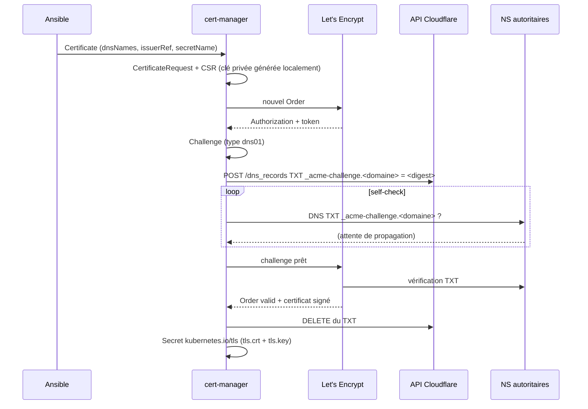

# Certificats HTTPS : Let's Encrypt + Cloudflare + Traefik

Analyse de l'existant dans ce dépôt : comment un certificat est émis, renouvelé,
consommé, et comment le HTTP est redirigé vers le HTTPS.

Sources lues : `roles/kube-services-setup/tasks/{cert-manager,traefik,nginx,wordpress,n8n-webhook-proxy,coredns-local,block-local-access}.yml`,
`roles/kube-services-setup/tasks/_cf-acme-cleanup.yml`, `roles/kube-services-setup/tasks/_netpol/`,
`roles/cloudflare-ddns/`, `deploy.yml`, `secrets-example.yml`.

> Le cluster n'était pas joignable au moment de l'analyse : tout ce qui suit vient
> du code, pas d'un `kubectl` en direct. Les points marqués **[à vérifier]** sont
> des déductions à confirmer sur le cluster (commandes fournies en §14).
>
> **État au 2026-08-16** : les écarts de §4.1 (`no_log`), §4.2 (`zoneID`), §5
> (dépendance cachée à `block-local-access`) et §12 (dérives README) sont corrigés.
> Le backlog de §13 reste ouvert, sauf les items 1 et 10.

---

## 1. Le résumé en un paragraphe

Cloudflare est en frontal (proxy orange), il termine le TLS côté visiteur. Le
routeur NAT 80/443 vers l'IP MetalLB publique, où Traefik termine un **second**
TLS avec un certificat Let's Encrypt émis par cert-manager. cert-manager valide
les domaines en **DNS-01 via l'API Cloudflare** — jamais en HTTP-01 — donc aucune
route publique temporaire, aucun port à ouvrir, et ça marche même avec le proxy
Cloudflare activé. Sur les routes publiques, le port 80 sert uniquement à
répondre `301` vers le HTTPS via un middleware Traefik.

```
Visiteur --TLS #1--> Cloudflare edge --TLS #2--> Traefik (:443) --HTTP--> Pod
                          ^                          ^
                    cert Cloudflare            cert Let's Encrypt
                                               (cert-manager, DNS-01)
```

---

## 2. Qui installe quoi, et dans quel ordre

| Brique | Installée par | Où |
|---|---|---|
| **cert-manager** | addon MicroK8s (`microk8s_plugins.cert-manager: true`) via le rôle `istvano.microk8s` | `deploy.yml`, 2ᵉ play |
| **ClusterIssuers + Secret Cloudflare** | tâches Ansible `kubernetes.core.k8s` | `tasks/cert-manager.yml` |
| **Traefik** | chart Helm `traefik/traefik` v40.3.0 | `tasks/traefik.yml` |
| **Middlewares TLS/redirect** | `extraObjects` du chart Helm | `tasks/traefik.yml` |
| **Certificate + IngressRoute** | par application | `tasks/<app>.yml` |
| **DNS public + DDNS** | script cron sur l'hôte | `roles/cloudflare-ddns/` |

Ordre imposé dans `tasks/main.yml` :

```yaml
- include_tasks: metalb.yml
- include_tasks: cert-manager.yml   # ClusterIssuers d'abord
- include_tasks: prometheus.yml     # fournit le CRD ServiceMonitor
- include_tasks: traefik.yml        # fournit le CRD IngressRoute
...
- include_tasks: nginx.yml          # Certificate + IngressRoute
```

Conséquence : cert-manager n'est **pas** géré par Helm ici. Sa version suit le
canal snap MicroK8s (`1.34/stable`) et n'est pinnée nulle part dans le dépôt.
C'est le point le moins reproductible de la chaîne — à mentionner dans l'article.

---

## 3. Pourquoi DNS-01 et pas HTTP-01

C'est la décision structurante. Quatre raisons, toutes vérifiables dans le code :

1. **Le proxy Cloudflare casse HTTP-01.** Le challenge HTTP-01 demande à Let's
   Encrypt d'aller lire `http://<domaine>/.well-known/acme-challenge/<token>`.
   Avec le nuage orange, c'est Cloudflare qui répond, pas l'origine. Et sur les
   routes publiques ici, le port 80 renvoie de toute façon un `301` (§7) — le
   challenge se ferait rediriger.
2. **Le middleware `cloudflare-ips` bloquerait le validateur.** Toutes les routes
   publiques passent par la chaîne `public-security`, qui contient une
   `ipAllowList` restreinte aux plages Cloudflare. Les serveurs de validation de
   Let's Encrypt ne sont pas dans ces plages → `403`.
3. **Aucune ouverture de port n'est nécessaire.** Le challenge se joue entre
   cert-manager et l'API Cloudflare, en sortie. Un service peut donc obtenir un
   certificat *avant* d'être exposé, ou sans jamais l'être.
4. **DNS-01 est le seul type qui permet les wildcards** (`*.example.com`). Pas
   utilisé ici, mais c'est l'ouverture évidente (§13).

`docs/public-private-exposure.md` le formule déjà : *« solver DNS-01 Cloudflare
uniquement — aucun challenge HTTP-01, donc aucune ouverture temporaire de route
publique n'est nécessaire »*.

---

## 4. Le ClusterIssuer, champ par champ

`roles/kube-services-setup/tasks/cert-manager.yml` crée trois objets.

### 4.1 Le secret du token Cloudflare

```yaml
- name: Create Cloudflare API Token Secret
  kubernetes.core.k8s:
    definition:
      apiVersion: v1
      kind: Secret
      metadata:
        name: cloudflare-api-token-secret
        namespace: cert-manager      # namespace créé par l'addon MicroK8s
      type: Opaque
      stringData:
        api-token: "{{ cloudflare.api_token }}"
```

Le token vient de `secrets.yml` (chiffré Ansible Vault), clé `cloudflare.api_token`.
Il est **partagé** avec le rôle `cloudflare-ddns` et avec `_cf-acme-cleanup.yml` :
un seul token pour trois usages.

Scopes attendus (documentés dans le README, template Cloudflare *Edit zone DNS*) :

| Permission | Pourquoi |
|---|---|
| `Zone → DNS → Edit` | créer/supprimer les TXT `_acme-challenge` |
| `Zone → Zone → Read` | cert-manager résout le nom vers son zone ID |

⚠️ **Point sécurité pour l'article** : cette tâche n'avait pas `no_log: true`,
alors que `_cf-acme-cleanup.yml` l'a — un `ansible-playbook -v` imprimait donc le
token en clair. **Corrigé** : `no_log: true` est posé sur la tâche.

### 4.2 Les deux ClusterIssuers

Staging et production, strictement identiques sauf l'URL du répertoire ACME :

```yaml
spec:
  acme:
    email: "{{ letsencrypt.email }}"
    server: https://acme-v02.api.letsencrypt.org/directory   # ou acme-staging-v02
    privateKeySecretRef:
      name: letsencrypt-prod        # clé de compte ACME, générée au 1er usage
    solvers:
      - dns01:
          cloudflare:
            apiTokenSecretRef:
              name: cloudflare-api-token-secret
              key: api-token
            zoneID: "{{ cloudflare.zone_identifier }}"
```

Trois remarques importantes :

- **`privateKeySecretRef` n'est pas le certificat.** C'est la clé privée du
  *compte* ACME. Si le Secret disparaît, cert-manager recrée un compte : les
  certificats existants restent valides, mais les quotas Let's Encrypt repartent
  d'une nouvelle identité.
- **`zoneID` n'existait pas dans le schéma du solver Cloudflare de cert-manager.**
  Le solver n'accepte que `email`, `apiKeySecretRef` et `apiTokenSecretRef` ; le
  zone ID est découvert automatiquement à partir du nom DNS. Le CRD étant
  structurel, l'API server **prunait silencieusement** ce champ : il ne cassait
  rien, il ne servait à rien. **Corrigé** : les deux lignes sont supprimées.
  `cloudflare.zone_identifier` reste utilisé par `_cf-acme-cleanup.yml` et le rôle
  `cloudflare-ddns`, la variable n'est donc pas orpheline.
- **Pas de `selector.dnsZones`.** Avec un seul solver sans sélecteur, il attrape
  tous les domaines. Correct ici, mais le README montre une version *avec*
  sélecteur qui ne correspond pas au code (§12).

### 4.3 Le staging est créé mais jamais utilisé

Aucun `Certificate` du dépôt ne référence `letsencrypt-staging` : les trois
(`nginx`, `wordpress`, `n8n-webhook-proxy`) pointent sur `letsencrypt-prod`.
C'est un piège réel — voir §11 sur les quotas.

---

## 5. Le cycle de vie d'un challenge, de bout en bout

C'est le cœur de l'article. Ce que cert-manager fait quand on applique un
`Certificate` :



Chaînage des ressources, utile pour débugger :

```
Certificate → CertificateRequest → Order → Challenge → Secret TLS
```

Chacune porte un statut ; un `kubectl describe` en remontant la chaîne donne
toujours la vraie cause (§14).

### La subtilité du self-check DNS

Avant de dire à Let's Encrypt « vas-y, vérifie », cert-manager interroge
lui-même les serveurs autoritaires jusqu'à voir le TXT. Ça évite de brûler une
tentative de validation sur un enregistrement non propagé. Deux conséquences
réseau, spécifiques à ce cluster :

1. Ce self-check sort en **UDP/TCP 53 vers des IP publiques**, pas vers le CoreDNS
   du cluster. Or la NetworkPolicy de `cert-manager` n'ouvre que :
   - `_netpol/dns-egress.yml` → UDP/TCP 53 mais **uniquement vers `kube-dns`** ;
   - `_netpol/kubeapi-egress.yml` ;
   - `_netpol/web-egress.yml` → TCP 80/443 vers Internet.

   Aucune de ces trois n'autorise le port 53 sortant vers Internet.
2. Ça passe quand même, grâce à `block-local-access.yml` (dernière tâche de
   `main.yml`) qui pose sur **chaque** namespace une policy d'egress
   `0.0.0.0/0 except <LAN>` **sans restriction de port**. Les NetworkPolicies
   étant additives, cette règle rouvre tout l'Internet, tous ports.

C'était un excellent point d'article : **la règle qui faisait marcher les
certificats n'était pas dans le fichier cert-manager**, elle était dans une tâche
de durcissement générique, et elle annulait au passage une bonne partie du bénéfice
de `web-egress.yml`.

**Corrigé** : `cert-manager.yml` porte maintenant une policy explicite,
`cert-manager-allow-dns01-selfcheck-egress`, qui autorise UDP/TCP 53 vers les IP
publiques. L'émission des certificats ne dépend plus d'une tâche tierce.

Deux conséquences du durcissement du finding #1 de
[`tailscale-metallb-access.md`](tailscale-metallb-access.md) :
`block-local-access.yml` excepte désormais les CIDR cluster, mais reste
**volontairement sans restriction de port** vers Internet — précisément pour ne pas
casser ce self-check. Le resserrer à 80/443 reste le piège à éviter.

---

## 6. Comment Traefik consomme le certificat

Pas d'annotation `cert-manager.io/cluster-issuer` sur un objet `Ingress` : le
dépôt utilise les CRD Traefik et **référence le Secret à la main**.

```yaml
# tasks/nginx.yml — le Certificate
spec:
  secretName: nginx-cert-prod        # ← le Secret produit
  issuerRef: { name: letsencrypt-prod, kind: ClusterIssuer }
  dnsNames: ["nginx.{{ network.public_domain }}"]
```

```yaml
# tasks/nginx.yml — l'IngressRoute HTTPS
spec:
  entryPoints: [websecure-public]
  routes:
    - match: Host(`nginx.{{ network.public_domain }}`)
      middlewares: [{ name: public-security, namespace: traefik }]
      services: [{ name: nginx, port: 80 }]
  tls:
    secretName: nginx-cert-prod      # ← le même Secret, même namespace
```

Points à retenir :

- **Le Secret TLS et l'IngressRoute doivent être dans le même namespace.** C'est
  pour ça que chaque application a *son* `Certificate` dans *son* namespace,
  plutôt qu'un certificat central.
- **Les middlewares, eux, traversent les namespaces**, grâce à
  `providers.kubernetesCRD.allowCrossNamespace: true` dans le chart. C'est ce qui
  permet à `nginx/nginx-https` de référencer `traefik/public-security`.
- **Traefik → Pod est en clair** (`port: 80`). La terminaison TLS est unique, au
  niveau du reverse proxy.
- **Pas de `TLSOption`** dans tout le dépôt : versions TLS et suites de chiffrement
  sont celles par défaut de Traefik.
- Si aucune route ne matche le SNI présenté, Traefik sert son **certificat
  auto-signé par défaut** — c'est exactement ce qui arrive sur `websecure-private`
  (§9).

---

## 7. Les redirections HTTP → HTTPS

### Le middleware

Défini une seule fois, en `extraObjects` du chart Traefik :

```yaml
- apiVersion: traefik.io/v1alpha1
  kind: Middleware
  metadata: { name: redirect-to-https, namespace: traefik }
  spec:
    redirectScheme:
      scheme: https
      permanent: true      # 301 (et non 302)
```

### Le patron : deux IngressRoutes, pas une

Traefik n'a pas de « global redirect » ici (le chart sait le faire via
`ports.web.redirectTo`, non utilisé). Le dépôt crée donc **deux** IngressRoutes
par service public :

```yaml
# 1. Le port 80 : matche, applique la sécurité, puis redirige
spec:
  entryPoints: [web-public]
  routes:
    - match: Host(`nginx.example.com`)
      middlewares:
        - { name: public-security,  namespace: traefik }   # ipAllowList + CrowdSec
        - { name: redirect-to-https, namespace: traefik }  # 301
      services: [{ name: nginx, port: 80 }]                # jamais atteint

# 2. Le port 443 : sert vraiment le trafic
spec:
  entryPoints: [websecure-public]
  routes:
    - match: Host(`nginx.example.com`)
      middlewares: [{ name: public-security, namespace: traefik }]
      services: [{ name: nginx, port: 80 }]
  tls: { secretName: nginx-cert-prod }
```

Deux détails qui valent une phrase dans l'article :

- **L'ordre des middlewares compte.** `public-security` est *avant*
  `redirect-to-https`. Une IP hors Cloudflare reçoit donc un `403`, pas un `301`
  — on ne révèle pas la route au scanner.
- **`services` reste obligatoire** sur la route de redirection, alors que le
  middleware court-circuite la requête. C'est une contrainte du CRD, pas un choix.

### Les trois patrons prévus dans le code

Chaque fichier applicatif public contient les deux variantes, une commentée :

| Patron | État dans le dépôt | Comportement sur `http://` |
|---|---|---|
| HTTP + HTTPS servis tous les deux | **commenté** | sert le contenu en clair |
| HTTP → 301 → HTTPS | **actif** (`nginx`, `wordpress`, `n8n-webhook-proxy`) | redirige |
| HTTPS seul (pas d'IngressRoute `web-public`) | non utilisé | `404` de Traefik |

---

## 8. La double couche TLS Cloudflare — le piège n°1

Le certificat Let's Encrypt de l'origine n'est **jamais vu par le visiteur** :
Cloudflare présente le sien. Alors pourquoi l'émettre ? Parce que le mode SSL du
zone Cloudflare décide de la façon dont Cloudflare parle à l'origine :

| Mode SSL Cloudflare | CF → origine | Résultat avec cette configuration |
|---|---|---|
| **Off** | HTTP:80 | boucle : `301` → Cloudflare renvoie en 80 → `301` → … |
| **Flexible** | HTTP:80 | **boucle de redirection infinie** (`ERR_TOO_MANY_REDIRECTS`) |
| **Full** | HTTPS:443, cert non vérifié | fonctionne, mais MITM possible entre CF et l'origine |
| **Full (strict)** | HTTPS:443, cert vérifié | ✅ le mode pour lequel ce dépôt est écrit |

C'est **la** raison d'être du certificat Let's Encrypt ici : sans lui, Full
(strict) échoue avec une erreur 526. Et c'est le symptôme le plus classique de
cette architecture — la boucle de redirection en mode Flexible s'explique
exactement par le middleware `redirect-to-https` de §7.

⚠️ Le mode SSL n'est configuré **nulle part dans ce dépôt** : c'est un réglage
manuel du dashboard Cloudflare, non versionné. Idem pour « Always Use HTTPS » et
le HSTS. À signaler comme dette dans l'article (§13).

---

## 9. Le cas des services privés : pas de certificat du tout

Les services internes (`heimdall`, `pgadmin`, `portainer`, `n8n`, `nextcloud`,
`jellyfin`, `qbittorrent`, `ghostfolio`, `kuma`, Prometheus/Grafana, dashboard
Traefik) suivent un patron totalement différent :

```yaml
spec:
  entryPoints: [web-private, websecure-private]   # les deux sur la MÊME route
  middlewares: [{ name: whitelist-local, namespace: traefik }]
  routes:
    - match: Host(`home.{{ network.private_domain }}`)
      services: [{ name: heimdall, port: 80 }]
  # pas de bloc tls: → pas de certificat
```

Conséquences, à énoncer clairement dans l'article :

- **Aucun `Certificate` cert-manager** : le domaine privé (`.lan` par défaut) n'est
  pas un domaine public, Let's Encrypt ne peut pas le valider.
- **`websecure-private` sert le certificat auto-signé par défaut de Traefik** →
  avertissement navigateur systématique.
- **Aucune redirection HTTP → HTTPS sur le privé.** Un `http://pgadmin.lan` reste
  en clair de bout en bout, mot de passe compris. Le patron `redirect-to-https`
  existe pourtant déjà (§7), il n'est simplement pas appliqué ici.
- Le DNS privé vient de CoreDNS (`tasks/coredns-local.yml`), avec un wildcard
  `* IN A <private_address>` sur la zone `{{ network.private_domain }}`. Aucune
  IngressRoute privée n'a besoin d'un enregistrement DNS dédié.

Options si on veut du vrai TLS en interne, par ordre de coût croissant :
certificat wildcard Let's Encrypt DNS-01 sur un sous-domaine public
(`*.priv.example.com`) pointant en A vers l'IP privée ; ou une CA interne
cert-manager (`selfSigned` → `ca`) avec la CA poussée sur les postes.

---

## 10. Le nettoyage des TXT `_acme-challenge`

`roles/kube-services-setup/tasks/_cf-acme-cleanup.yml` est un contournement
maison, appelé juste avant chaque `Certificate` :

```yaml
- include_tasks: _cf-acme-cleanup.yml
  vars:
    cf_acme_namespace: nginx
    cf_acme_secret_name: nginx-cert-prod
    cf_acme_dns_name: "nginx.{{ network.public_domain }}"
```

Le problème qu'il traite, décrit dans son propre en-tête : si une validation est
interrompue en plein vol (playbook coupé, cluster réinstallé), le TXT
`_acme-challenge.<domaine>` reste orphelin sur Cloudflare, et la validation
suivante s'emmêle entre l'ancien et le nouveau token.

La logique est conditionnelle, et c'est ce qui la rend sûre :

```
Le Secret TLS existe déjà dans le cluster ?
  ├── oui → on ne touche à rien (cert sain ou émission en cours)
  └── non → GET  /zones/<zone>/dns_records?type=TXT&name=_acme-challenge.<domaine>
            DELETE chaque enregistrement trouvé
```

Deux notes :

- Les appels d'API sont en `no_log: true` (contrairement à la création du Secret,
  §4.1).
- C'est bien un contournement, pas une fonctionnalité : à mentionner comme tel.
  Un TXT orphelin sur un sous-domaine `_acme-challenge` est inoffensif en soi, le
  problème est la confusion côté cert-manager lors du ré-emploi.

---

## 11. Renouvellement, quotas, et ce qui n'est pas surveillé

- **Renouvellement** : automatique, par cert-manager. Aucun `duration` ni
  `renewBefore` n'est spécifié dans les `Certificate` → défauts cert-manager :
  90 jours de validité, renouvellement à **T-30 jours**. Chaque renouvellement
  rejoue un challenge DNS-01 complet (§5) — donc l'API Cloudflare doit rester
  joignable et le token valide en permanence, pas seulement au déploiement.
- **Quotas Let's Encrypt production** : 50 certificats par domaine enregistré et
  par semaine, et surtout **5 certificats identiques par semaine**. Un cycle de
  réinstallation un peu répété tape le second plafond très vite. C'est
  exactement le cas d'usage du ClusterIssuer `letsencrypt-staging`… qui n'est
  utilisé par aucun `Certificate` (§4.3).
- **Aucune alerte sur l'expiration.** Le dépôt a Prometheus, des `PrometheusRule`
  (dont `TraefikDown`) et Uptime Kuma, mais rien sur les certificats. cert-manager
  expose pourtant `certmanager_certificate_expiration_timestamp_seconds` et
  `certmanager_certificate_ready_status` : il manque un `ServiceMonitor` sur
  `cert-manager` et une règle du type `expiration - time() < 7d`. Le monitor
  Kuma sur `https://nginx.<domaine>` ne compte pas : il tape **Cloudflare**, donc
  il resterait vert avec un certificat d'origine expiré.
- **Le token Cloudflare n'a pas de rotation** et est partagé avec le DDNS.

---

## 12. Écarts entre le README et le code

| README | Code réel | État |
|---|---|---|
| ClusterIssuer avec `selector.dnsZones` | pas de `selector` : un solver unique sans sélecteur attrape tous les domaines | **assumé** — l'exemple du README reste l'idéal à viser, pas un miroir du code |
| exemples en `nginx-cert-staging` / `letsencrypt-staging` | tout est en `-prod` | **assumé** — même exemple ; la §11 explique quand basculer en staging |
| le README montrait aussi un champ `zoneID` | supprimé du code (§4.2) | corrigé |
| « toutes les IngressRoutes publiques incluent le middleware `cloudflare-ips` » | elles incluent la **chaîne `public-security`** (`cloudflare-ips` → `crowdsec-bouncer`) ; Minecraft n'a ni l'un ni l'autre | corrigé |
| « Pattern 1 : HTTP + HTTPS » présenté comme le défaut | c'est le **Pattern 2** (redirect) qui est actif partout | corrigé |
| README l. 28 : « Let's Encrypt TLS » dans le flux public | exact, mais ne dit pas que le visiteur voit le cert Cloudflare (§8) | non modifié |

Les deux premières lignes sont un choix délibéré : le bloc `ClusterIssuer` du
README est un exemple pédagogique (staging d'abord, sélecteur explicite), pas la
transcription de `cert-manager.yml`. À garder en tête en le lisant.

---

## 13. Limites et pistes d'amélioration

Par ordre de rapport valeur/effort :

1. ~~**`no_log: true` sur la création du Secret Cloudflare**~~ — fait, §4.1.
2. **Alerte d'expiration** — `ServiceMonitor` cert-manager + `PrometheusRule`, §11.
3. **`redirect-to-https` sur les routes privées** — le middleware existe déjà, §9.
4. **Utiliser `letsencrypt-staging`** via une variable (`letsencrypt.issuer`) pour
   les cycles de réinstallation, §4.3.
5. **Certificat wildcard** `*.{{ network.public_domain }}` — un seul `Certificate`
   dans un namespace dédié, réplication du Secret vers les namespaces applicatifs
   (`reflector`/`kyverno`), moins de challenges, moins de quota consommé.
6. **`TLSOption`** Traefik : `minVersion: VersionTLS13`, suites explicites, §6.
7. **HSTS** : middleware `headers.stsSeconds` côté Traefik ou réglage Cloudflare,
   aujourd'hui absent des deux.
8. **Documenter/automatiser le mode SSL Cloudflare** (Full strict) — aujourd'hui
   uniquement manuel dans le dashboard, §8.
9. **Pinner la version de cert-manager** plutôt que de suivre l'addon snap, §2.
10. ~~**Rendre `block-local-access.yml` explicite** sur le fait qu'il conditionne
    l'émission des certificats~~ — fait autrement : cert-manager porte sa propre
    policy 53 sortante (§5). `--dns01-recursive-nameservers-only` reste une option
    si on veut en plus fixer les résolveurs interrogés.
11. **Fusionner les deux IngressRoutes** en utilisant `ports.web-public.redirectTo`
    au niveau du chart, si on accepte une redirection globale plutôt que par route.

---

## 14. Commandes de debug (pour la partie pratique de l'article)

```bash
ssh ansible@192.168.1.202 -p 30000    # puis microk8s kubectl ...

# Vue d'ensemble
kubectl get clusterissuer
kubectl get certificate -A
kubectl get secret -A --field-selector type=kubernetes.io/tls

# zoneID a été retiré du code (§4.2) ; sur un cluster déjà déployé, vérifier
# qu'il n'en reste aucune trace
kubectl get clusterissuer letsencrypt-prod -o yaml | grep -i zoneid   # aucun résultat attendu

# Remonter la chaîne quand un cert ne sort pas
kubectl describe certificate  nginx-cert-prod -n nginx
kubectl get   certificaterequest -n nginx
kubectl get   order              -n nginx -o wide
kubectl describe challenge       -n nginx        # la vraie cause est ici
kubectl -n cert-manager logs deploy/cert-manager -f

# Voir le TXT du challenge en cours, côté public
dig +short TXT _acme-challenge.nginx.example.com @1.1.1.1

# Le TXT côté Cloudflare (ce que _cf-acme-cleanup.yml interroge)
curl -s -H "Authorization: Bearer $CF_TOKEN" \
  "https://api.cloudflare.com/client/v4/zones/$ZONE/dns_records?type=TXT&name=_acme-challenge.nginx.example.com" | jq

# Contenu et dates du certificat émis
kubectl -n nginx get secret nginx-cert-prod -o jsonpath='{.data.tls\.crt}' \
  | base64 -d | openssl x509 -noout -subject -issuer -dates

# Le certificat réellement servi par l'origine (court-circuite Cloudflare)
openssl s_client -connect 192.168.1.210:443 -servername nginx.example.com </dev/null \
  | openssl x509 -noout -subject -issuer -dates

# Le certificat vu par un visiteur (c'est celui de Cloudflare)
openssl s_client -connect nginx.example.com:443 -servername nginx.example.com </dev/null \
  | openssl x509 -noout -issuer

# Vérifier la redirection 301
curl -sI http://nginx.example.com | head -3

# Traefik : routes et certificats chargés (dashboard privé)
#   http://traefik.lan/dashboard/
```

---

## 15. Angles possibles pour l'article

Trois découpages, du plus tutoriel au plus opinion :

1. **« HTTPS automatique derrière Cloudflare : pourquoi DNS-01 est la seule
   option »** — §3 → §5 → §8. Le fil rouge est le piège de la boucle de
   redirection en mode Flexible, qui explique tout le reste.
2. **« Deux TLS valent mieux qu'un »** — §8 en ouverture, puis §6 et §7. Public
   plus large, angle « ce que Cloudflare ne fait pas à votre place ».
3. **« Ce que le tutoriel ne dit pas »** — §5 (la NetworkPolicy qui conditionne
   l'émission sans que ce soit écrit nulle part), §10 (les TXT orphelins), §11
   (les quotas et l'absence d'alerte), §9 (le privé en clair). C'est l'angle le
   plus original : les trois problèmes viennent de l'exploitation, pas de la mise
   en place.

Checklist reproduction minimale, si l'article doit être suivable :

1. Domaine sur Cloudflare, proxy activé, **SSL mode = Full (strict)**.
2. Token API scopé `Zone:DNS:Edit` + `Zone:Zone:Read`.
3. cert-manager installé, Secret du token dans le namespace `cert-manager`.
4. ClusterIssuer `letsencrypt-staging` **d'abord** — valider, puis passer en prod.
5. `Certificate` dans le namespace de l'app, `secretName` explicite.
6. Deux IngressRoutes : `web-*` avec `redirect-to-https`, `websecure-*` avec
   `tls.secretName`.
7. NAT 80 **et** 443 vers l'IP publique (le 80 sert la redirection, pas ACME).
8. Vérifier l'egress DNS sortant du pod cert-manager avant de durcir les policies.
